Title: Face Generation using GANs
Date: 2018-06-02
Category: GANs, Deep Learning
Tags: TensorFlow
Authors: Cihan Soylu


In this project, you'll use generative adversarial networks to generate new images of faces.
### Get the Data
You'll be using two datasets in this project:
- MNIST
- CelebA

Since the celebA dataset is complex and you're doing GANs in a project for the first time, we want you to test your neural network on MNIST before CelebA.  Running the GANs on MNIST will allow you to see how well your model trains sooner.

If you're using [FloydHub](https://www.floydhub.com/), set `data_dir` to "/input" and use the [FloydHub data ID](http://docs.floydhub.com/home/using_datasets/) "R5KrjnANiKVhLWAkpXhNBe".


```python
data_dir = './data'

# FloydHub - Use with data ID "R5KrjnANiKVhLWAkpXhNBe"
#data_dir = '/input'


"""
DON'T MODIFY ANYTHING IN THIS CELL
"""
import helper

helper.download_extract('mnist', data_dir)
helper.download_extract('celeba', data_dir)
```

    Found mnist Data
    Found celeba Data


## Explore the Data
### MNIST
As you're aware, the [MNIST](http://yann.lecun.com/exdb/mnist/) dataset contains images of handwritten digits. You can view the first number of examples by changing `show_n_images`.


```python
show_n_images = 25

"""
DON'T MODIFY ANYTHING IN THIS CELL
"""
%matplotlib inline
import os
from glob import glob
from matplotlib import pyplot

mnist_images = helper.get_batch(glob(os.path.join(data_dir, 'mnist/*.jpg'))[:show_n_images], 28, 28, 'L')
pyplot.imshow(helper.images_square_grid(mnist_images, 'L'), cmap='gray')
```

    /home/ubuntu/anaconda3/envs/tf_env/lib/python3.6/site-packages/matplotlib/__init__.py:1067: UserWarning: Duplicate key in file "/home/ubuntu/.config/matplotlib/matplotlibrc", line #2
      (fname, cnt))
    /home/ubuntu/anaconda3/envs/tf_env/lib/python3.6/site-packages/matplotlib/__init__.py:1067: UserWarning: Duplicate key in file "/home/ubuntu/.config/matplotlib/matplotlibrc", line #3
      (fname, cnt))


    <matplotlib.image.AxesImage at 0x7f8aa021d8d0>


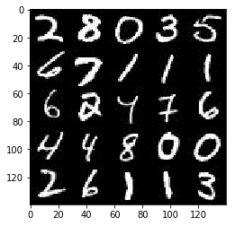


### CelebA
The [CelebFaces Attributes Dataset (CelebA)](http://mmlab.ie.cuhk.edu.hk/projects/CelebA.html) dataset contains over 200,000 celebrity images with annotations.  Since you're going to be generating faces, you won't need the annotations.  You can view the first number of examples by changing `show_n_images`.


```python
show_n_images = 25

"""
DON'T MODIFY ANYTHING IN THIS CELL
"""
mnist_images = helper.get_batch(glob(os.path.join(data_dir, 'img_align_celeba/*.jpg'))[:show_n_images], 28, 28, 'RGB')
pyplot.imshow(helper.images_square_grid(mnist_images, 'RGB'))
```


    <matplotlib.image.AxesImage at 0x7f8a9c7fae80>


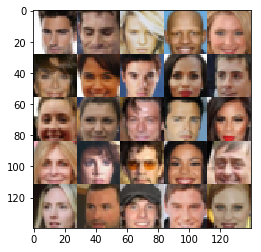


## Preprocess the Data
Since the project's main focus is on building the GANs, we'll preprocess the data for you.  The values of the MNIST and CelebA dataset will be in the range of -0.5 to 0.5 of 28x28 dimensional images.  The CelebA images will be cropped to remove parts of the image that don't include a face, then resized down to 28x28.

The MNIST images are black and white images with a single [color channel](https://en.wikipedia.org/wiki/Channel_(digital_image%29) while the CelebA images have [3 color channels (RGB color channel)](https://en.wikipedia.org/wiki/Channel_(digital_image%29#RGB_Images).
## Build the Neural Network
You'll build the components necessary to build a GANs by implementing the following functions below:
- `model_inputs`
- `discriminator`
- `generator`
- `model_loss`
- `model_opt`
- `train`

### Check the Version of TensorFlow and Access to GPU
This will check to make sure you have the correct version of TensorFlow and access to a GPU


```python
"""
DON'T MODIFY ANYTHING IN THIS CELL
"""
from distutils.version import LooseVersion
import warnings
import tensorflow as tf

# Check TensorFlow Version
assert LooseVersion(tf.__version__) >= LooseVersion('1.0'), 'Please use TensorFlow version 1.0 or newer.  You are using {}'.format(tf.__version__)
print('TensorFlow Version: {}'.format(tf.__version__))

# Check for a GPU
if not tf.test.gpu_device_name():
    warnings.warn('No GPU found. Please use a GPU to train your neural network.')
else:
    print('Default GPU Device: {}'.format(tf.test.gpu_device_name()))
```

    /home/ubuntu/anaconda3/envs/tf_env/lib/python3.6/site-packages/h5py/__init__.py:36: FutureWarning: Conversion of the second argument of issubdtype from `float` to `np.floating` is deprecated. In future, it will be treated as `np.float64 == np.dtype(float).type`.
      from ._conv import register_converters as _register_converters


    TensorFlow Version: 1.8.0
    Default GPU Device: /device:GPU:0


### Input
Implement the `model_inputs` function to create TF Placeholders for the Neural Network. It should create the following placeholders:
- Real input images placeholder with rank 4 using `image_width`, `image_height`, and `image_channels`.
- Z input placeholder with rank 2 using `z_dim`.
- Learning rate placeholder with rank 0.

Return the placeholders in the following the tuple (tensor of real input images, tensor of z data)


```python
import problem_unittests as tests

def model_inputs(image_width, image_height, image_channels, z_dim):
    """
    Create the model inputs
    :param image_width: The input image width
    :param image_height: The input image height
    :param image_channels: The number of image channels
    :param z_dim: The dimension of Z
    :return: Tuple of (tensor of real input images, tensor of z data, learning rate)
    """
    # TODO: Implement Function
    input_real = tf.placeholder(tf.float32, (None, image_width, image_height, image_channels), name = 'real_input')
    input_z = tf.placeholder(tf.float32, (None, z_dim), name = 'z_data')
    lr = tf.placeholder(tf.float32, name = 'learning_rate')

    return (input_real, input_z, lr)


"""
DON'T MODIFY ANYTHING IN THIS CELL THAT IS BELOW THIS LINE
"""
tests.test_model_inputs(model_inputs)
```

    Tests Passed


### Discriminator
Implement `discriminator` to create a discriminator neural network that discriminates on `images`.  This function should be able to reuse the variables in the neural network.  Use [`tf.variable_scope`](https://www.tensorflow.org/api_docs/python/tf/variable_scope) with a scope name of "discriminator" to allow the variables to be reused.  The function should return a tuple of (tensor output of the discriminator, tensor logits of the discriminator).


```python
def discriminator(images, reuse=False):
    """
    Create the discriminator network
    :param images: Tensor of input image(s)
    :param reuse: Boolean if the weights should be reused
    :return: Tuple of (tensor output of the discriminator, tensor logits of the discriminator)
    """

    # TODO: Implement Function
    alpha = 0.2

    with tf.variable_scope('discriminator', reuse = reuse):
        #First convolution layer
        conv1 = tf.layers.conv2d(images, 64, 5, strides = 1, padding = 'same', kernel_initializer=tf.contrib.layers.xavier_initializer())
        conv1 = tf.maximum(alpha*conv1, conv1)
        conv1 = tf.layers.average_pooling2d(conv1, pool_size = 2, strides = 2)
        #batch_size x 14 x 14 x 64

        #Second convolution layer
        conv2 = tf.layers.conv2d(conv1, 128, 5, strides = 1, padding = 'same', kernel_initializer=tf.contrib.layers.xavier_initializer())
        conv2 = tf.layers.batch_normalization(conv2, training = True)
        conv2 = tf.maximum(alpha*conv2, conv2)
        conv2 = tf.layers.average_pooling2d(conv2, pool_size = 2, strides = 2)
        #batch_size x 7 x 7 x 128

        #Third layer
        conv3 = tf.layers.conv2d(conv2, 256, 5, strides = 1, padding = 'same', kernel_initializer=tf.contrib.layers.xavier_initializer())
        conv3 = tf.layers.batch_normalization(conv3, training = True)
        conv3 = tf.maximum(alpha*conv3, conv3)
        conv3 = tf.layers.average_pooling2d(conv3, pool_size = 2, strides = 1)
        #batch_size x 7 x 7 x 256

        #Flatten
        flat = tf.layers.flatten(conv3)
        logits = tf.layers.dense(flat, 1)
        out = tf.sigmoid(logits)

    return (out, logits)


"""
DON'T MODIFY ANYTHING IN THIS CELL THAT IS BELOW THIS LINE
"""
tests.test_discriminator(discriminator, tf)
```

    Tests Passed


### Generator
Implement `generator` to generate an image using `z`. This function should be able to reuse the variables in the neural network.  Use [`tf.variable_scope`](https://www.tensorflow.org/api_docs/python/tf/variable_scope) with a scope name of "generator" to allow the variables to be reused. The function should return the generated 28 x 28 x `out_channel_dim` images.


```python
def generator(z, out_channel_dim, is_train=True):
    """
    Create the generator network
    :param z: Input z
    :param out_channel_dim: The number of channels in the output image
    :param is_train: Boolean if generator is being used for training
    :return: The tensor output of the generator
    """

    # TODO: Implement Function
    alpha = 0.2

    # variable_scope will reuse the variables exactly when it is not training
    with tf.variable_scope('generator', reuse = not is_train):
        #Reshape z using a fully connexted layer
        z_reshaped = tf.layers.dense(z, 7*7*512)
        z_reshaped = tf.reshape(z_reshaped, (-1, 7, 7, 512))
        z_reshaped = tf.layers.batch_normalization(z_reshaped, training = is_train)
        z_reshaped = tf.maximum(z_reshaped * alpha, z_reshaped)
        #batch_size x 7 x 7 x 512


        #First convolution layer
        conv1 = tf.layers.conv2d_transpose(z_reshaped, 256, 5, strides = 2, padding = 'same',kernel_initializer=tf.contrib.layers.xavier_initializer())
        conv1 = tf.layers.batch_normalization(conv1, training = is_train)
        conv1 = tf.maximum(conv1 * alpha, conv1)
        #batch_size x 14 x 14 x 256


        #Second convolution layer
        conv2 = tf.layers.conv2d_transpose(conv1, 128, 5, strides = 2, padding = 'same',kernel_initializer=tf.contrib.layers.xavier_initializer())
        conv2 = tf.layers.batch_normalization(conv2, training = is_train)
        conv2 = tf.maximum(conv2 * alpha, conv2)
        #batch_size x 28 x 28 x 128


        # Output layer
        logits = tf.layers.conv2d_transpose(conv2, out_channel_dim, 5, strides=1, padding='same',kernel_initializer=tf.contrib.layers.xavier_initializer())
        # batch_size x 28 x 28 x out_channel_dim

        out = tf.tanh(logits)

    return out


"""
DON'T MODIFY ANYTHING IN THIS CELL THAT IS BELOW THIS LINE
"""
tests.test_generator(generator, tf)
```

    Tests Passed


### Loss
Implement `model_loss` to build the GANs for training and calculate the loss.  The function should return a tuple of (discriminator loss, generator loss).  Use the following functions you implemented:
- `discriminator(images, reuse=False)`
- `generator(z, out_channel_dim, is_train=True)`


```python
def model_loss(input_real, input_z, out_channel_dim):
    """
    Get the loss for the discriminator and generator
    :param input_real: Images from the real dataset
    :param input_z: Z input
    :param out_channel_dim: The number of channels in the output image
    :return: A tuple of (discriminator loss, generator loss)
    """
    # TODO: Implement Function
    #generator output
    g_model = generator(input_z, out_channel_dim)

    #discriminator output and logits for the real input
    d_model_real, d_logits_real = discriminator(input_real)

    #discriminator output and logits for the fake inputs generated by the generator
    d_model_fake, d_logits_fake = discriminator(g_model, reuse=True)

    d_loss_real = tf.reduce_mean(
        tf.nn.sigmoid_cross_entropy_with_logits(logits=d_logits_real, labels=tf.ones_like(d_model_real)))
    d_loss_fake = tf.reduce_mean(
        tf.nn.sigmoid_cross_entropy_with_logits(logits=d_logits_fake, labels=tf.zeros_like(d_model_fake)))
    g_loss = tf.reduce_mean(
        tf.nn.sigmoid_cross_entropy_with_logits(logits=d_logits_fake, labels=tf.ones_like(d_model_fake)))

    d_loss = d_loss_real + d_loss_fake

    return (d_loss, g_loss)


"""
DON'T MODIFY ANYTHING IN THIS CELL THAT IS BELOW THIS LINE
"""
tests.test_model_loss(model_loss)
```

    Tests Passed


### Optimization
Implement `model_opt` to create the optimization operations for the GANs. Use [`tf.trainable_variables`](https://www.tensorflow.org/api_docs/python/tf/trainable_variables) to get all the trainable variables.  Filter the variables with names that are in the discriminator and generator scope names.  The function should return a tuple of (discriminator training operation, generator training operation).


```python
def model_opt(d_loss, g_loss, learning_rate, beta1):
    """
    Get optimization operations
    :param d_loss: Discriminator loss Tensor
    :param g_loss: Generator loss Tensor
    :param learning_rate: Learning Rate Placeholder
    :param beta1: The exponential decay rate for the 1st moment in the optimizer
    :return: A tuple of (discriminator training operation, generator training operation)
    """
    # TODO: Implement Function
    #get trainable variables
    t_vars = tf.trainable_variables()
    d_vars = [var for var in t_vars if var.name.startswith('discriminator')]
    g_vars = [var for var in t_vars if var.name.startswith('generator')]

    # Optimization
    with tf.control_dependencies(tf.get_collection(tf.GraphKeys.UPDATE_OPS)):
        d_train_opt = tf.train.AdamOptimizer(learning_rate, beta1=beta1).minimize(d_loss, var_list=d_vars)
        g_train_opt = tf.train.AdamOptimizer(learning_rate, beta1=beta1).minimize(g_loss, var_list=g_vars)

    return (d_train_opt, g_train_opt)


"""
DON'T MODIFY ANYTHING IN THIS CELL THAT IS BELOW THIS LINE
"""
tests.test_model_opt(model_opt, tf)
```

    Tests Passed


## Neural Network Training
### Show Output
Use this function to show the current output of the generator during training. It will help you determine how well the GANs is training.


```python
"""
DON'T MODIFY ANYTHING IN THIS CELL
"""
import numpy as np

def show_generator_output(sess, n_images, input_z, out_channel_dim, image_mode):
    """
    Show example output for the generator
    :param sess: TensorFlow session
    :param n_images: Number of Images to display
    :param input_z: Input Z Tensor
    :param out_channel_dim: The number of channels in the output image
    :param image_mode: The mode to use for images ("RGB" or "L")
    """
    cmap = None if image_mode == 'RGB' else 'gray'
    z_dim = input_z.get_shape().as_list()[-1]
    example_z = np.random.uniform(-1, 1, size=[n_images, z_dim])

    samples = sess.run(
        generator(input_z, out_channel_dim, False),
        feed_dict={input_z: example_z})

    images_grid = helper.images_square_grid(samples, image_mode)
    pyplot.imshow(images_grid, cmap=cmap)
    pyplot.show()
```

### Train
Implement `train` to build and train the GANs.  Use the following functions you implemented:
- `model_inputs(image_width, image_height, image_channels, z_dim)`
- `model_loss(input_real, input_z, out_channel_dim)`
- `model_opt(d_loss, g_loss, learning_rate, beta1)`

Use the `show_generator_output` to show `generator` output while you train. Running `show_generator_output` for every batch will drastically increase training time and increase the size of the notebook.  It's recommended to print the `generator` output every 100 batches.


```python
def train(epoch_count, batch_size, z_dim, learning_rate, beta1, get_batches, data_shape, data_image_mode):
    """
    Train the GAN
    :param epoch_count: Number of epochs
    :param batch_size: Batch Size
    :param z_dim: Z dimension
    :param learning_rate: Learning Rate
    :param beta1: The exponential decay rate for the 1st moment in the optimizer
    :param get_batches: Function to get batches
    :param data_shape: Shape of the data
    :param data_image_mode: The image mode to use for images ("RGB" or "L")
    """
    # TODO: Build Model

    #Figure out if the data is RGB or Gray and assign the channel dim.
    width, height, channel_dim = data_shape[1], data_shape[2], data_shape[3]

    #inputs
    input_real, input_z, lr = model_inputs(width, height, channel_dim, z_dim)

    #loss
    d_loss, g_loss = model_loss(input_real, input_z, channel_dim)

    #optimization
    d_opt, g_opt = model_opt(d_loss, g_loss, learning_rate, beta1)

    #Count the batches and display generator output if count = 0 mod 100
    count = 0

    with tf.Session() as sess:
        sess.run(tf.global_variables_initializer())
        for epoch_i in range(epoch_count):
            for batch_images in get_batches(batch_size):
                # TODO: Train Model
                count += 1

                batch_images = batch_images * 2

                #Noise for the generator
                batch_z = np.random.normal(0, 0.5, size=(batch_size, z_dim))

                #run the optimizers
                _ = sess.run(d_opt, feed_dict = {input_real : batch_images,
                                                 input_z : batch_z,
                                                 lr : learning_rate})
                _ = sess.run(g_opt, feed_dict = {input_real : batch_images,
                                                 input_z : batch_z,
                                                 lr : learning_rate})

                if count % 5 == 0:
                    train_loss_d = d_loss.eval({input_real : batch_images, input_z: batch_z})
                    train_loss_g = g_loss.eval({input_z: batch_z})

                    print("Step {}...".format(count),
                          "Discriminator Loss: {:.4f}...".format(train_loss_d),
                          "Generator Loss: {:.4f}".format(train_loss_g))

                #Show the generator images for a sample_z at every 100 batches.
                if count % 100 == 0:
                    show_generator_output(sess, 25, input_z, channel_dim, data_image_mode)

            # Print the discriminator loss and generator loss at the end of each epoch.
            train_loss_d = d_loss.eval({input_real : batch_images, input_z: batch_z})
            train_loss_g = g_loss.eval({input_z: batch_z})

            print("Epoch {}...".format(epoch_i),
                  "Discriminator Loss: {:.4f}...".format(train_loss_d),
                  "Generator Loss: {:.4f}".format(train_loss_g))

```

### MNIST
Test your GANs architecture on MNIST.  After 2 epochs, the GANs should be able to generate images that look like handwritten digits.  Make sure the loss of the generator is lower than the loss of the discriminator or close to 0.


```python
batch_size = 128
z_dim = 100
learning_rate = 0.001
beta1 = 0.5


"""
DON'T MODIFY ANYTHING IN THIS CELL THAT IS BELOW THIS LINE
"""
epochs = 2

mnist_dataset = helper.Dataset('mnist', glob(os.path.join(data_dir, 'mnist/*.jpg')))
with tf.Graph().as_default():
    train(epochs, batch_size, z_dim, learning_rate, beta1, mnist_dataset.get_batches,
          mnist_dataset.shape, mnist_dataset.image_mode)
```

    Step 5... Discriminator Loss: 0.0132... Generator Loss: 19.8729
    Step 10... Discriminator Loss: 1.6550... Generator Loss: 7.7244
    Step 15... Discriminator Loss: 5.0040... Generator Loss: 0.4213
    Step 20... Discriminator Loss: 1.7102... Generator Loss: 2.6561
    Step 25... Discriminator Loss: 0.6065... Generator Loss: 3.2815
    Step 30... Discriminator Loss: 1.4856... Generator Loss: 0.5491
    Step 35... Discriminator Loss: 1.4928... Generator Loss: 2.1344
    Step 40... Discriminator Loss: 1.6014... Generator Loss: 0.6536
    Step 45... Discriminator Loss: 1.4724... Generator Loss: 3.1468
    Step 50... Discriminator Loss: 1.3560... Generator Loss: 1.6324
    Step 55... Discriminator Loss: 1.2371... Generator Loss: 0.9748
    Step 60... Discriminator Loss: 1.8370... Generator Loss: 0.2637
    Step 65... Discriminator Loss: 1.3210... Generator Loss: 0.8764
    Step 70... Discriminator Loss: 1.5460... Generator Loss: 1.6745
    Step 75... Discriminator Loss: 1.6859... Generator Loss: 0.4534
    Step 80... Discriminator Loss: 1.8087... Generator Loss: 0.6910
    Step 85... Discriminator Loss: 1.9604... Generator Loss: 1.4759
    Step 90... Discriminator Loss: 1.4417... Generator Loss: 1.0977
    Step 95... Discriminator Loss: 1.7718... Generator Loss: 0.4168
    Step 100... Discriminator Loss: 1.7579... Generator Loss: 0.4653


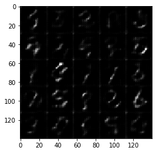


    Step 105... Discriminator Loss: 1.3964... Generator Loss: 0.8371
    Step 110... Discriminator Loss: 1.0146... Generator Loss: 0.8755
    Step 115... Discriminator Loss: 1.7888... Generator Loss: 0.3782
    Step 120... Discriminator Loss: 1.3065... Generator Loss: 0.7546
    Step 125... Discriminator Loss: 1.4160... Generator Loss: 0.6358
    Step 130... Discriminator Loss: 2.0514... Generator Loss: 0.2114
    Step 135... Discriminator Loss: 1.2688... Generator Loss: 1.0981
    Step 140... Discriminator Loss: 1.4052... Generator Loss: 0.6012
    Step 145... Discriminator Loss: 1.6040... Generator Loss: 1.0063
    Step 150... Discriminator Loss: 1.5717... Generator Loss: 0.3364
    Step 155... Discriminator Loss: 1.3377... Generator Loss: 0.5204
    Step 160... Discriminator Loss: 1.4698... Generator Loss: 1.2263
    Step 165... Discriminator Loss: 1.2961... Generator Loss: 0.6015
    Step 170... Discriminator Loss: 1.4613... Generator Loss: 1.4857
    Step 175... Discriminator Loss: 1.2952... Generator Loss: 0.5418
    Step 180... Discriminator Loss: 1.3271... Generator Loss: 0.6724
    Step 185... Discriminator Loss: 1.4205... Generator Loss: 1.7888
    Step 190... Discriminator Loss: 1.3184... Generator Loss: 0.6132
    Step 195... Discriminator Loss: 1.4116... Generator Loss: 0.5278
    Step 200... Discriminator Loss: 1.1987... Generator Loss: 0.8998


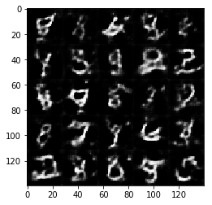


    Step 205... Discriminator Loss: 1.3046... Generator Loss: 0.6927
    Step 210... Discriminator Loss: 1.6092... Generator Loss: 1.8052
    Step 215... Discriminator Loss: 1.1268... Generator Loss: 0.9801
    Step 220... Discriminator Loss: 1.2321... Generator Loss: 0.9394
    Step 225... Discriminator Loss: 1.6007... Generator Loss: 0.3184
    Step 230... Discriminator Loss: 1.4479... Generator Loss: 1.5025
    Step 235... Discriminator Loss: 1.2774... Generator Loss: 0.7429
    Step 240... Discriminator Loss: 1.4886... Generator Loss: 1.5338
    Step 245... Discriminator Loss: 1.2119... Generator Loss: 0.7671
    Step 250... Discriminator Loss: 1.4542... Generator Loss: 0.4060
    Step 255... Discriminator Loss: 1.3724... Generator Loss: 1.0318
    Step 260... Discriminator Loss: 1.2521... Generator Loss: 0.8717
    Step 265... Discriminator Loss: 2.0169... Generator Loss: 0.1913
    Step 270... Discriminator Loss: 1.3036... Generator Loss: 0.6506
    Step 275... Discriminator Loss: 1.2150... Generator Loss: 1.0589
    Step 280... Discriminator Loss: 1.2302... Generator Loss: 0.5495
    Step 285... Discriminator Loss: 1.4185... Generator Loss: 0.4335
    Step 290... Discriminator Loss: 1.2761... Generator Loss: 0.6988
    Step 295... Discriminator Loss: 1.2390... Generator Loss: 0.6984
    Step 300... Discriminator Loss: 1.2968... Generator Loss: 0.4458


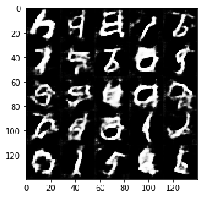


    Step 305... Discriminator Loss: 1.3321... Generator Loss: 1.1651
    Step 310... Discriminator Loss: 1.2529... Generator Loss: 0.9608
    Step 315... Discriminator Loss: 1.4206... Generator Loss: 0.4185
    Step 320... Discriminator Loss: 1.2380... Generator Loss: 0.8843
    Step 325... Discriminator Loss: 1.2228... Generator Loss: 0.6809
    Step 330... Discriminator Loss: 1.1961... Generator Loss: 1.0372
    Step 335... Discriminator Loss: 1.5163... Generator Loss: 0.3369
    Step 340... Discriminator Loss: 1.2052... Generator Loss: 0.9190
    Step 345... Discriminator Loss: 1.4457... Generator Loss: 0.4506
    Step 350... Discriminator Loss: 1.1385... Generator Loss: 1.7275
    Step 355... Discriminator Loss: 1.1355... Generator Loss: 0.9085
    Step 360... Discriminator Loss: 1.2156... Generator Loss: 0.7965
    Step 365... Discriminator Loss: 1.9613... Generator Loss: 2.1148
    Step 370... Discriminator Loss: 1.3226... Generator Loss: 1.0952
    Step 375... Discriminator Loss: 1.2941... Generator Loss: 0.5097
    Step 380... Discriminator Loss: 1.2041... Generator Loss: 1.2211
    Step 385... Discriminator Loss: 1.3269... Generator Loss: 0.5180
    Step 390... Discriminator Loss: 1.5223... Generator Loss: 1.4279
    Step 395... Discriminator Loss: 1.2850... Generator Loss: 0.5352
    Step 400... Discriminator Loss: 1.1534... Generator Loss: 0.8523


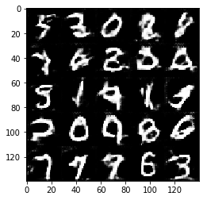


    Step 405... Discriminator Loss: 1.3981... Generator Loss: 0.4200
    Step 410... Discriminator Loss: 1.2791... Generator Loss: 1.0866
    Step 415... Discriminator Loss: 1.1769... Generator Loss: 0.6917
    Step 420... Discriminator Loss: 1.9837... Generator Loss: 2.1030
    Step 425... Discriminator Loss: 1.3070... Generator Loss: 0.5047
    Step 430... Discriminator Loss: 1.2624... Generator Loss: 0.5398
    Step 435... Discriminator Loss: 1.1649... Generator Loss: 0.6787
    Step 440... Discriminator Loss: 1.8130... Generator Loss: 1.8245
    Step 445... Discriminator Loss: 1.2088... Generator Loss: 0.7811
    Step 450... Discriminator Loss: 1.1578... Generator Loss: 0.6996
    Step 455... Discriminator Loss: 1.3934... Generator Loss: 1.7250
    Step 460... Discriminator Loss: 1.8224... Generator Loss: 0.2214
    Step 465... Discriminator Loss: 1.1542... Generator Loss: 0.6534
    Epoch 0... Discriminator Loss: 1.1701... Generator Loss: 0.8294
    Step 470... Discriminator Loss: 1.1619... Generator Loss: 0.7776
    Step 475... Discriminator Loss: 1.6682... Generator Loss: 0.2855
    Step 480... Discriminator Loss: 1.3470... Generator Loss: 0.4548
    Step 485... Discriminator Loss: 1.0888... Generator Loss: 0.7922
    Step 490... Discriminator Loss: 1.0831... Generator Loss: 1.0828
    Step 495... Discriminator Loss: 1.6264... Generator Loss: 0.3100
    Step 500... Discriminator Loss: 1.1001... Generator Loss: 1.0007


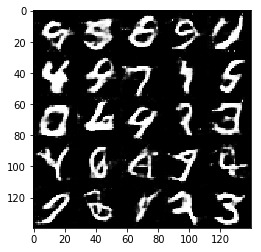


    Step 505... Discriminator Loss: 1.1130... Generator Loss: 0.8506
    Step 510... Discriminator Loss: 1.0382... Generator Loss: 0.9422
    Step 515... Discriminator Loss: 1.6332... Generator Loss: 0.2824
    Step 520... Discriminator Loss: 1.3602... Generator Loss: 0.4263
    Step 525... Discriminator Loss: 1.2024... Generator Loss: 1.0296
    Step 530... Discriminator Loss: 1.2042... Generator Loss: 0.6284
    Step 535... Discriminator Loss: 1.4320... Generator Loss: 1.1825
    Step 540... Discriminator Loss: 1.2783... Generator Loss: 0.7100
    Step 545... Discriminator Loss: 1.2463... Generator Loss: 0.5351
    Step 550... Discriminator Loss: 1.1422... Generator Loss: 0.7336
    Step 555... Discriminator Loss: 1.4952... Generator Loss: 0.3571
    Step 560... Discriminator Loss: 1.2193... Generator Loss: 0.6403
    Step 565... Discriminator Loss: 1.0470... Generator Loss: 1.0010
    Step 570... Discriminator Loss: 2.4044... Generator Loss: 0.1272
    Step 575... Discriminator Loss: 1.0142... Generator Loss: 1.0524
    Step 580... Discriminator Loss: 1.2395... Generator Loss: 0.5421
    Step 585... Discriminator Loss: 1.3108... Generator Loss: 0.4367
    Step 590... Discriminator Loss: 1.9438... Generator Loss: 2.1032
    Step 595... Discriminator Loss: 1.2208... Generator Loss: 0.9308
    Step 600... Discriminator Loss: 1.3042... Generator Loss: 0.5526


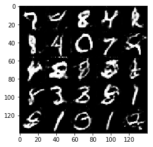


    Step 605... Discriminator Loss: 1.1944... Generator Loss: 1.4732
    Step 610... Discriminator Loss: 1.1500... Generator Loss: 0.8281
    Step 615... Discriminator Loss: 1.2430... Generator Loss: 0.6023
    Step 620... Discriminator Loss: 1.1309... Generator Loss: 1.0574
    Step 625... Discriminator Loss: 1.8743... Generator Loss: 0.2670
    Step 630... Discriminator Loss: 1.3841... Generator Loss: 0.4158
    Step 635... Discriminator Loss: 1.1981... Generator Loss: 0.6626
    Step 640... Discriminator Loss: 1.2533... Generator Loss: 0.5091
    Step 645... Discriminator Loss: 1.8318... Generator Loss: 2.1632
    Step 650... Discriminator Loss: 1.1619... Generator Loss: 0.8153
    Step 655... Discriminator Loss: 1.1637... Generator Loss: 0.5819
    Step 660... Discriminator Loss: 1.1449... Generator Loss: 1.2561
    Step 665... Discriminator Loss: 1.6704... Generator Loss: 0.3011
    Step 670... Discriminator Loss: 1.3077... Generator Loss: 0.5021
    Step 675... Discriminator Loss: 1.0818... Generator Loss: 0.8674
    Step 680... Discriminator Loss: 1.0400... Generator Loss: 1.3247
    Step 685... Discriminator Loss: 1.2210... Generator Loss: 0.5984
    Step 690... Discriminator Loss: 1.2177... Generator Loss: 0.9072
    Step 695... Discriminator Loss: 1.1271... Generator Loss: 0.7940
    Step 700... Discriminator Loss: 1.8959... Generator Loss: 0.2020


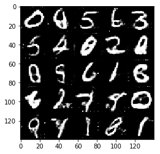


    Step 705... Discriminator Loss: 1.3469... Generator Loss: 0.5102
    Step 710... Discriminator Loss: 1.0616... Generator Loss: 1.0739
    Step 715... Discriminator Loss: 1.1173... Generator Loss: 0.6413
    Step 720... Discriminator Loss: 1.3655... Generator Loss: 0.4534
    Step 725... Discriminator Loss: 1.6625... Generator Loss: 1.8142
    Step 730... Discriminator Loss: 1.2755... Generator Loss: 0.5393
    Step 735... Discriminator Loss: 1.2527... Generator Loss: 0.6488
    Step 740... Discriminator Loss: 1.2193... Generator Loss: 1.1277
    Step 745... Discriminator Loss: 1.1827... Generator Loss: 0.8113
    Step 750... Discriminator Loss: 1.0847... Generator Loss: 0.7530
    Step 755... Discriminator Loss: 1.0684... Generator Loss: 0.8178
    Step 760... Discriminator Loss: 1.2075... Generator Loss: 0.9049
    Step 765... Discriminator Loss: 1.5202... Generator Loss: 0.3421
    Step 770... Discriminator Loss: 1.1868... Generator Loss: 0.6520
    Step 775... Discriminator Loss: 1.0661... Generator Loss: 1.1626
    Step 780... Discriminator Loss: 2.5279... Generator Loss: 0.1063
    Step 785... Discriminator Loss: 1.1657... Generator Loss: 0.6478
    Step 790... Discriminator Loss: 1.2603... Generator Loss: 1.2586
    Step 795... Discriminator Loss: 1.1211... Generator Loss: 0.9515
    Step 800... Discriminator Loss: 1.3100... Generator Loss: 0.4775


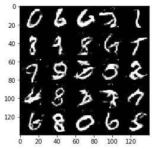


    Step 805... Discriminator Loss: 1.3097... Generator Loss: 0.4795
    Step 810... Discriminator Loss: 1.0629... Generator Loss: 1.0431
    Step 815... Discriminator Loss: 1.4825... Generator Loss: 0.4095
    Step 820... Discriminator Loss: 1.1287... Generator Loss: 0.9051
    Step 825... Discriminator Loss: 1.2970... Generator Loss: 0.4765
    Step 830... Discriminator Loss: 1.1145... Generator Loss: 0.9441
    Step 835... Discriminator Loss: 1.1831... Generator Loss: 1.0812
    Step 840... Discriminator Loss: 1.2590... Generator Loss: 0.7139
    Step 845... Discriminator Loss: 1.0445... Generator Loss: 1.0381
    Step 850... Discriminator Loss: 1.1549... Generator Loss: 1.3960
    Step 855... Discriminator Loss: 1.3179... Generator Loss: 0.4584
    Step 860... Discriminator Loss: 1.0093... Generator Loss: 1.0428
    Step 865... Discriminator Loss: 1.0543... Generator Loss: 0.7742
    Step 870... Discriminator Loss: 1.3245... Generator Loss: 2.1738
    Step 875... Discriminator Loss: 1.5918... Generator Loss: 0.3427
    Step 880... Discriminator Loss: 1.0920... Generator Loss: 0.6063
    Step 885... Discriminator Loss: 0.9014... Generator Loss: 1.9787
    Step 890... Discriminator Loss: 1.1476... Generator Loss: 0.6222
    Step 895... Discriminator Loss: 0.9443... Generator Loss: 1.3650
    Step 900... Discriminator Loss: 1.5578... Generator Loss: 0.4920


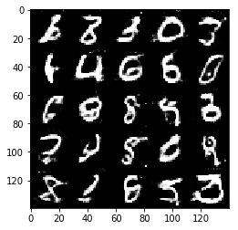


    Step 905... Discriminator Loss: 1.2279... Generator Loss: 0.6500
    Step 910... Discriminator Loss: 1.0293... Generator Loss: 1.0163
    Step 915... Discriminator Loss: 1.2634... Generator Loss: 0.5684
    Step 920... Discriminator Loss: 1.6350... Generator Loss: 2.0453
    Step 925... Discriminator Loss: 1.0023... Generator Loss: 1.2724
    Step 930... Discriminator Loss: 1.1344... Generator Loss: 0.7229
    Step 935... Discriminator Loss: 1.0399... Generator Loss: 0.9823
    Epoch 1... Discriminator Loss: 0.9909... Generator Loss: 0.9741


### CelebA
Run your GANs on CelebA.  It will take around 20 minutes on the average GPU to run one epoch.  You can run the whole epoch or stop when it starts to generate realistic faces.


```python
batch_size = 128
z_dim = 100
learning_rate = 0.001
beta1 = 0.5


"""
DON'T MODIFY ANYTHING IN THIS CELL THAT IS BELOW THIS LINE
"""
epochs = 1

celeba_dataset = helper.Dataset('celeba', glob(os.path.join(data_dir, 'img_align_celeba/*.jpg')))
with tf.Graph().as_default():
    train(epochs, batch_size, z_dim, learning_rate, beta1, celeba_dataset.get_batches,
          celeba_dataset.shape, celeba_dataset.image_mode)
```

    Step 5... Discriminator Loss: 2.1750... Generator Loss: 0.7857
    Step 10... Discriminator Loss: 1.4007... Generator Loss: 1.8337
    Step 15... Discriminator Loss: 0.8487... Generator Loss: 1.6952
    Step 20... Discriminator Loss: 0.9492... Generator Loss: 1.0827
    Step 25... Discriminator Loss: 0.8261... Generator Loss: 2.5317
    Step 30... Discriminator Loss: 0.5083... Generator Loss: 1.2092
    Step 35... Discriminator Loss: 0.2836... Generator Loss: 2.1855
    Step 40... Discriminator Loss: 0.7949... Generator Loss: 0.8825
    Step 45... Discriminator Loss: 1.0094... Generator Loss: 0.9177
    Step 50... Discriminator Loss: 1.0589... Generator Loss: 1.2881
    Step 55... Discriminator Loss: 0.0848... Generator Loss: 3.6973
    Step 60... Discriminator Loss: 0.1350... Generator Loss: 2.6230
    Step 65... Discriminator Loss: 0.1538... Generator Loss: 3.1470
    Step 70... Discriminator Loss: 1.2935... Generator Loss: 2.3943
    Step 75... Discriminator Loss: 1.1411... Generator Loss: 0.8399
    Step 80... Discriminator Loss: 2.0308... Generator Loss: 0.7010
    Step 85... Discriminator Loss: 1.2143... Generator Loss: 2.3305
    Step 90... Discriminator Loss: 1.5781... Generator Loss: 1.3694
    Step 95... Discriminator Loss: 1.8432... Generator Loss: 2.1317
    Step 100... Discriminator Loss: 1.5632... Generator Loss: 0.9092


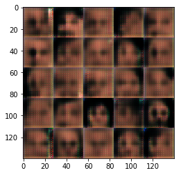


    Step 105... Discriminator Loss: 1.7742... Generator Loss: 0.9275
    Step 110... Discriminator Loss: 1.5204... Generator Loss: 0.8216
    Step 115... Discriminator Loss: 1.4923... Generator Loss: 0.4285
    Step 120... Discriminator Loss: 1.3644... Generator Loss: 0.8451
    Step 125... Discriminator Loss: 1.3909... Generator Loss: 0.6782
    Step 130... Discriminator Loss: 1.6375... Generator Loss: 1.1500
    Step 135... Discriminator Loss: 1.1122... Generator Loss: 1.2452
    Step 140... Discriminator Loss: 1.3749... Generator Loss: 0.9240
    Step 145... Discriminator Loss: 1.4531... Generator Loss: 0.6333
    Step 150... Discriminator Loss: 1.2759... Generator Loss: 1.1572
    Step 155... Discriminator Loss: 1.3095... Generator Loss: 0.6354
    Step 160... Discriminator Loss: 1.5880... Generator Loss: 0.4510
    Step 165... Discriminator Loss: 1.3337... Generator Loss: 0.6295
    Step 170... Discriminator Loss: 1.0504... Generator Loss: 0.8568
    Step 175... Discriminator Loss: 2.0160... Generator Loss: 1.7600
    Step 180... Discriminator Loss: 1.0927... Generator Loss: 1.0502
    Step 185... Discriminator Loss: 1.6992... Generator Loss: 0.9863
    Step 190... Discriminator Loss: 1.4817... Generator Loss: 0.6290
    Step 195... Discriminator Loss: 1.4163... Generator Loss: 0.6620
    Step 200... Discriminator Loss: 1.4286... Generator Loss: 0.7328


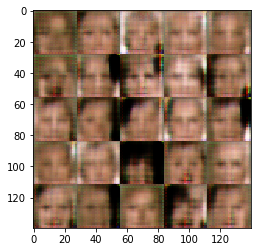


    Step 205... Discriminator Loss: 1.1383... Generator Loss: 0.9682
    Step 210... Discriminator Loss: 1.6041... Generator Loss: 0.7681
    Step 215... Discriminator Loss: 1.4891... Generator Loss: 0.5821
    Step 220... Discriminator Loss: 1.2026... Generator Loss: 0.7832
    Step 225... Discriminator Loss: 1.6705... Generator Loss: 0.2998
    Step 230... Discriminator Loss: 1.2651... Generator Loss: 0.7044
    Step 235... Discriminator Loss: 1.5581... Generator Loss: 0.4037
    Step 240... Discriminator Loss: 1.4032... Generator Loss: 0.4443
    Step 245... Discriminator Loss: 1.1761... Generator Loss: 0.8532
    Step 250... Discriminator Loss: 1.4824... Generator Loss: 0.8536
    Step 255... Discriminator Loss: 1.6343... Generator Loss: 0.5071
    Step 260... Discriminator Loss: 1.2807... Generator Loss: 0.6644
    Step 265... Discriminator Loss: 1.4060... Generator Loss: 1.3131
    Step 270... Discriminator Loss: 1.5634... Generator Loss: 0.8583
    Step 275... Discriminator Loss: 1.0171... Generator Loss: 0.8413
    Step 280... Discriminator Loss: 1.6481... Generator Loss: 0.3537
    Step 285... Discriminator Loss: 1.1943... Generator Loss: 0.6993
    Step 290... Discriminator Loss: 1.5753... Generator Loss: 0.3861
    Step 295... Discriminator Loss: 1.2980... Generator Loss: 0.7835
    Step 300... Discriminator Loss: 1.3421... Generator Loss: 0.7932


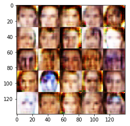


    Step 305... Discriminator Loss: 1.4738... Generator Loss: 0.7905
    Step 310... Discriminator Loss: 1.7528... Generator Loss: 0.3030
    Step 315... Discriminator Loss: 1.3070... Generator Loss: 0.6224
    Step 320... Discriminator Loss: 1.2204... Generator Loss: 0.8240
    Step 325... Discriminator Loss: 1.1738... Generator Loss: 1.1482
    Step 330... Discriminator Loss: 1.9104... Generator Loss: 0.2363
    Step 335... Discriminator Loss: 1.5483... Generator Loss: 0.8371
    Step 340... Discriminator Loss: 1.2788... Generator Loss: 0.5869
    Step 345... Discriminator Loss: 1.5368... Generator Loss: 0.3482
    Step 350... Discriminator Loss: 1.2125... Generator Loss: 0.8760
    Step 355... Discriminator Loss: 1.1210... Generator Loss: 0.9925
    Step 360... Discriminator Loss: 1.4195... Generator Loss: 0.6581
    Step 365... Discriminator Loss: 1.4086... Generator Loss: 0.8169
    Step 370... Discriminator Loss: 1.2831... Generator Loss: 0.8570
    Step 375... Discriminator Loss: 1.4248... Generator Loss: 0.4109
    Step 380... Discriminator Loss: 1.1194... Generator Loss: 1.0693
    Step 385... Discriminator Loss: 0.9655... Generator Loss: 0.7456
    Step 390... Discriminator Loss: 2.0822... Generator Loss: 2.2656
    Step 395... Discriminator Loss: 0.9869... Generator Loss: 0.9730
    Step 400... Discriminator Loss: 1.2763... Generator Loss: 1.0490


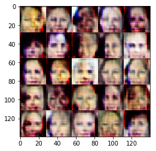


    Step 405... Discriminator Loss: 2.0641... Generator Loss: 2.0028
    Step 410... Discriminator Loss: 2.1558... Generator Loss: 2.6775
    Step 415... Discriminator Loss: 1.1533... Generator Loss: 0.7023
    Step 420... Discriminator Loss: 1.6114... Generator Loss: 0.4137
    Step 425... Discriminator Loss: 1.2950... Generator Loss: 0.7080
    Step 430... Discriminator Loss: 1.2679... Generator Loss: 1.2056
    Step 435... Discriminator Loss: 2.1074... Generator Loss: 0.1886
    Step 440... Discriminator Loss: 1.2164... Generator Loss: 0.9442
    Step 445... Discriminator Loss: 1.3331... Generator Loss: 0.6983
    Step 450... Discriminator Loss: 1.2223... Generator Loss: 0.6639
    Step 455... Discriminator Loss: 1.4257... Generator Loss: 0.5361
    Step 460... Discriminator Loss: 1.3957... Generator Loss: 0.6081
    Step 465... Discriminator Loss: 1.2150... Generator Loss: 0.8488
    Step 470... Discriminator Loss: 0.9786... Generator Loss: 0.8783
    Step 475... Discriminator Loss: 1.1928... Generator Loss: 0.7699
    Step 480... Discriminator Loss: 1.3118... Generator Loss: 0.9567
    Step 485... Discriminator Loss: 1.2950... Generator Loss: 1.0038
    Step 490... Discriminator Loss: 1.2358... Generator Loss: 0.8056
    Step 495... Discriminator Loss: 1.1002... Generator Loss: 0.9191
    Step 500... Discriminator Loss: 1.2765... Generator Loss: 1.0361


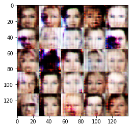


    Step 505... Discriminator Loss: 1.2158... Generator Loss: 0.6162
    Step 510... Discriminator Loss: 1.0725... Generator Loss: 0.9664
    Step 515... Discriminator Loss: 1.7799... Generator Loss: 1.7149
    Step 520... Discriminator Loss: 1.2084... Generator Loss: 0.9637
    Step 525... Discriminator Loss: 1.6044... Generator Loss: 1.2315
    Step 530... Discriminator Loss: 1.4432... Generator Loss: 0.6866
    Step 535... Discriminator Loss: 0.9874... Generator Loss: 1.0340
    Step 540... Discriminator Loss: 1.3747... Generator Loss: 0.8791
    Step 545... Discriminator Loss: 1.2719... Generator Loss: 0.4903
    Step 550... Discriminator Loss: 1.1592... Generator Loss: 1.2533
    Step 555... Discriminator Loss: 1.2497... Generator Loss: 1.1475
    Step 560... Discriminator Loss: 1.2875... Generator Loss: 0.7316
    Step 565... Discriminator Loss: 1.1561... Generator Loss: 0.8825
    Step 570... Discriminator Loss: 2.3586... Generator Loss: 2.4490
    Step 575... Discriminator Loss: 1.4141... Generator Loss: 0.5618
    Step 580... Discriminator Loss: 1.4720... Generator Loss: 0.7643
    Step 585... Discriminator Loss: 1.2692... Generator Loss: 0.5615
    Step 590... Discriminator Loss: 1.2592... Generator Loss: 0.9303
    Step 595... Discriminator Loss: 1.4886... Generator Loss: 0.4495
    Step 600... Discriminator Loss: 1.1057... Generator Loss: 0.7432


    Step 605... Discriminator Loss: 2.0625... Generator Loss: 1.8385
    Step 610... Discriminator Loss: 1.5253... Generator Loss: 0.5614
    Step 615... Discriminator Loss: 1.0685... Generator Loss: 1.1989
    Step 620... Discriminator Loss: 1.8232... Generator Loss: 0.2602
    Step 625... Discriminator Loss: 0.9993... Generator Loss: 0.8880
    Step 630... Discriminator Loss: 0.9398... Generator Loss: 1.1216
    Step 635... Discriminator Loss: 1.5184... Generator Loss: 0.4429
    Step 640... Discriminator Loss: 1.5371... Generator Loss: 0.3886
    Step 645... Discriminator Loss: 1.3115... Generator Loss: 0.6415
    Step 650... Discriminator Loss: 1.1985... Generator Loss: 0.7664
    Step 655... Discriminator Loss: 1.4613... Generator Loss: 1.4627
    Step 660... Discriminator Loss: 1.2976... Generator Loss: 0.6706
    Step 665... Discriminator Loss: 1.3912... Generator Loss: 0.6345
    Step 670... Discriminator Loss: 1.1978... Generator Loss: 0.5745
    Step 675... Discriminator Loss: 1.3105... Generator Loss: 0.9631
    Step 680... Discriminator Loss: 1.3547... Generator Loss: 1.2493
    Step 685... Discriminator Loss: 1.3087... Generator Loss: 0.5533
    Step 690... Discriminator Loss: 1.2390... Generator Loss: 0.9174
    Step 695... Discriminator Loss: 1.2655... Generator Loss: 0.5001
    Step 700... Discriminator Loss: 1.3587... Generator Loss: 0.5010


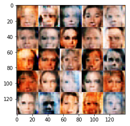


    Step 705... Discriminator Loss: 1.1262... Generator Loss: 0.9063
    Step 710... Discriminator Loss: 1.3254... Generator Loss: 0.4270
    Step 715... Discriminator Loss: 1.5429... Generator Loss: 0.3361
    Step 720... Discriminator Loss: 1.9854... Generator Loss: 1.0730
    Step 725... Discriminator Loss: 1.3520... Generator Loss: 0.4722
    Step 730... Discriminator Loss: 1.5723... Generator Loss: 0.6036
    Step 735... Discriminator Loss: 1.4815... Generator Loss: 0.4640
    Step 740... Discriminator Loss: 1.3516... Generator Loss: 0.5504
    Step 745... Discriminator Loss: 1.1803... Generator Loss: 0.9822
    Step 750... Discriminator Loss: 1.0991... Generator Loss: 1.0393
    Step 755... Discriminator Loss: 1.0626... Generator Loss: 0.8307
    Step 760... Discriminator Loss: 1.9956... Generator Loss: 0.3301
    Step 765... Discriminator Loss: 1.2333... Generator Loss: 0.7105
    Step 770... Discriminator Loss: 1.4957... Generator Loss: 1.3149
    Step 775... Discriminator Loss: 1.5500... Generator Loss: 0.4668
    Step 780... Discriminator Loss: 1.2455... Generator Loss: 0.8976
    Step 785... Discriminator Loss: 1.3780... Generator Loss: 0.5254
    Step 790... Discriminator Loss: 1.6517... Generator Loss: 0.3599
    Step 795... Discriminator Loss: 1.4458... Generator Loss: 1.3547
    Step 800... Discriminator Loss: 1.3581... Generator Loss: 0.7130


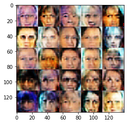


    Step 805... Discriminator Loss: 1.0584... Generator Loss: 1.0460
    Step 810... Discriminator Loss: 1.2401... Generator Loss: 0.9120
    Step 815... Discriminator Loss: 1.2706... Generator Loss: 0.5397
    Step 820... Discriminator Loss: 1.2633... Generator Loss: 1.0127
    Step 825... Discriminator Loss: 1.4346... Generator Loss: 1.2039
    Step 830... Discriminator Loss: 1.3739... Generator Loss: 0.7213
    Step 835... Discriminator Loss: 1.4820... Generator Loss: 0.9154
    Step 840... Discriminator Loss: 1.4469... Generator Loss: 0.4889
    Step 845... Discriminator Loss: 1.3048... Generator Loss: 0.9175
    Step 850... Discriminator Loss: 1.4789... Generator Loss: 0.7980
    Step 855... Discriminator Loss: 1.2323... Generator Loss: 1.0487
    Step 860... Discriminator Loss: 1.2339... Generator Loss: 0.9772
    Step 865... Discriminator Loss: 1.4124... Generator Loss: 1.1128
    Step 870... Discriminator Loss: 1.2362... Generator Loss: 0.9196
    Step 875... Discriminator Loss: 1.2532... Generator Loss: 0.7062
    Step 880... Discriminator Loss: 1.2470... Generator Loss: 0.9429
    Step 885... Discriminator Loss: 1.4080... Generator Loss: 1.3919
    Step 890... Discriminator Loss: 1.5303... Generator Loss: 1.2297
    Step 895... Discriminator Loss: 1.3999... Generator Loss: 0.7799
    Step 900... Discriminator Loss: 1.4592... Generator Loss: 0.3921


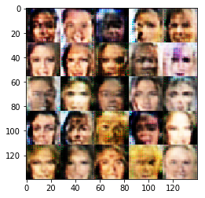


    Step 905... Discriminator Loss: 1.2135... Generator Loss: 0.7108
    Step 910... Discriminator Loss: 1.5547... Generator Loss: 1.0146
    Step 915... Discriminator Loss: 1.5680... Generator Loss: 0.3834
    Step 920... Discriminator Loss: 1.1866... Generator Loss: 0.9189
    Step 925... Discriminator Loss: 1.3212... Generator Loss: 0.6757
    Step 930... Discriminator Loss: 1.3830... Generator Loss: 0.4992
    Step 935... Discriminator Loss: 1.5535... Generator Loss: 1.0225
    Step 940... Discriminator Loss: 1.2417... Generator Loss: 0.7948
    Step 945... Discriminator Loss: 1.3193... Generator Loss: 0.5512
    Step 950... Discriminator Loss: 1.4343... Generator Loss: 1.3442
    Step 955... Discriminator Loss: 1.4469... Generator Loss: 0.5782
    Step 960... Discriminator Loss: 1.3997... Generator Loss: 0.7469
    Step 965... Discriminator Loss: 1.5432... Generator Loss: 0.4723
    Step 970... Discriminator Loss: 1.3328... Generator Loss: 0.7884
    Step 975... Discriminator Loss: 1.3138... Generator Loss: 0.7283
    Step 980... Discriminator Loss: 1.0799... Generator Loss: 0.9595
    Step 985... Discriminator Loss: 1.2286... Generator Loss: 0.7845
    Step 990... Discriminator Loss: 1.3158... Generator Loss: 0.6527
    Step 995... Discriminator Loss: 1.4178... Generator Loss: 1.0640
    Step 1000... Discriminator Loss: 1.2177... Generator Loss: 0.6756


    Step 1005... Discriminator Loss: 1.2911... Generator Loss: 1.5028
    Step 1010... Discriminator Loss: 1.2882... Generator Loss: 0.7055
    Step 1015... Discriminator Loss: 1.3364... Generator Loss: 0.5386
    Step 1020... Discriminator Loss: 1.2892... Generator Loss: 0.4372
    Step 1025... Discriminator Loss: 1.4086... Generator Loss: 0.5505
    Step 1030... Discriminator Loss: 1.2747... Generator Loss: 1.0802
    Step 1035... Discriminator Loss: 1.4209... Generator Loss: 0.7881
    Step 1040... Discriminator Loss: 1.2913... Generator Loss: 0.8136
    Step 1045... Discriminator Loss: 1.3732... Generator Loss: 0.6236
    Step 1050... Discriminator Loss: 1.3405... Generator Loss: 0.5916
    Step 1055... Discriminator Loss: 1.4487... Generator Loss: 0.4518
    Step 1060... Discriminator Loss: 1.2706... Generator Loss: 0.7128
    Step 1065... Discriminator Loss: 1.3399... Generator Loss: 0.9706
    Step 1070... Discriminator Loss: 1.2722... Generator Loss: 0.8427
    Step 1075... Discriminator Loss: 1.3033... Generator Loss: 0.7303
    Step 1080... Discriminator Loss: 1.2077... Generator Loss: 0.8240
    Step 1085... Discriminator Loss: 1.2494... Generator Loss: 0.4589
    Step 1090... Discriminator Loss: 1.3932... Generator Loss: 0.5749
    Step 1095... Discriminator Loss: 1.4142... Generator Loss: 1.1942
    Step 1100... Discriminator Loss: 1.4156... Generator Loss: 0.6594


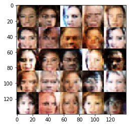


    Step 1105... Discriminator Loss: 1.3342... Generator Loss: 0.8203
    Step 1110... Discriminator Loss: 1.3412... Generator Loss: 0.5893
    Step 1115... Discriminator Loss: 1.6022... Generator Loss: 0.5987
    Step 1120... Discriminator Loss: 1.4914... Generator Loss: 0.5419
    Step 1125... Discriminator Loss: 0.9787... Generator Loss: 1.1209
    Step 1130... Discriminator Loss: 1.2587... Generator Loss: 0.8622
    Step 1135... Discriminator Loss: 1.2397... Generator Loss: 0.8726
    Step 1140... Discriminator Loss: 1.2907... Generator Loss: 0.9125
    Step 1145... Discriminator Loss: 1.4313... Generator Loss: 1.0452
    Step 1150... Discriminator Loss: 1.2727... Generator Loss: 0.7818
    Step 1155... Discriminator Loss: 1.3521... Generator Loss: 0.6149
    Step 1160... Discriminator Loss: 1.4436... Generator Loss: 0.5685
    Step 1165... Discriminator Loss: 1.4127... Generator Loss: 0.4658
    Step 1170... Discriminator Loss: 1.5179... Generator Loss: 1.2324
    Step 1175... Discriminator Loss: 1.2913... Generator Loss: 0.5453
    Step 1180... Discriminator Loss: 1.2960... Generator Loss: 0.6485
    Step 1185... Discriminator Loss: 1.3888... Generator Loss: 1.0688
    Step 1190... Discriminator Loss: 1.3164... Generator Loss: 0.6993
    Step 1195... Discriminator Loss: 1.3395... Generator Loss: 0.6867
    Step 1200... Discriminator Loss: 1.3840... Generator Loss: 0.5324


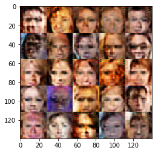


    Step 1205... Discriminator Loss: 1.2078... Generator Loss: 0.8031
    Step 1210... Discriminator Loss: 1.5080... Generator Loss: 0.5482
    Step 1215... Discriminator Loss: 1.3344... Generator Loss: 0.7627
    Step 1220... Discriminator Loss: 1.2996... Generator Loss: 1.3337
    Step 1225... Discriminator Loss: 1.5205... Generator Loss: 0.4083
    Step 1230... Discriminator Loss: 1.2910... Generator Loss: 0.9062
    Step 1235... Discriminator Loss: 1.4074... Generator Loss: 0.9330
    Step 1240... Discriminator Loss: 1.3106... Generator Loss: 0.8880
    Step 1245... Discriminator Loss: 1.3836... Generator Loss: 0.6558
    Step 1250... Discriminator Loss: 1.3772... Generator Loss: 0.6155
    Step 1255... Discriminator Loss: 1.3477... Generator Loss: 0.7210
    Step 1260... Discriminator Loss: 1.2366... Generator Loss: 0.8136
    Step 1265... Discriminator Loss: 1.5502... Generator Loss: 0.7077
    Step 1270... Discriminator Loss: 1.3484... Generator Loss: 0.6478
    Step 1275... Discriminator Loss: 1.2023... Generator Loss: 0.8183
    Step 1280... Discriminator Loss: 1.6009... Generator Loss: 0.7731
    Step 1285... Discriminator Loss: 1.2980... Generator Loss: 1.0907
    Step 1290... Discriminator Loss: 1.3509... Generator Loss: 0.5907
    Step 1295... Discriminator Loss: 1.1431... Generator Loss: 0.8298
    Step 1300... Discriminator Loss: 1.1440... Generator Loss: 0.7364


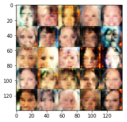


    Step 1305... Discriminator Loss: 1.1487... Generator Loss: 1.4820
    Step 1310... Discriminator Loss: 1.1603... Generator Loss: 0.8047
    Step 1315... Discriminator Loss: 1.4471... Generator Loss: 0.4971
    Step 1320... Discriminator Loss: 1.3231... Generator Loss: 0.6469
    Step 1325... Discriminator Loss: 1.2970... Generator Loss: 0.6582
    Step 1330... Discriminator Loss: 1.2885... Generator Loss: 0.7762
    Step 1335... Discriminator Loss: 1.2688... Generator Loss: 0.6595
    Step 1340... Discriminator Loss: 1.5934... Generator Loss: 0.3409
    Step 1345... Discriminator Loss: 1.1211... Generator Loss: 0.8762
    Step 1350... Discriminator Loss: 1.3803... Generator Loss: 0.6189
    Step 1355... Discriminator Loss: 1.3057... Generator Loss: 0.6216
    Step 1360... Discriminator Loss: 1.4310... Generator Loss: 0.5275
    Step 1365... Discriminator Loss: 1.3283... Generator Loss: 0.8451
    Step 1370... Discriminator Loss: 1.3850... Generator Loss: 0.7480
    Step 1375... Discriminator Loss: 1.2166... Generator Loss: 0.7529
    Step 1380... Discriminator Loss: 1.3088... Generator Loss: 0.5923
    Step 1385... Discriminator Loss: 1.2846... Generator Loss: 0.5871
    Step 1390... Discriminator Loss: 1.5271... Generator Loss: 0.4129
    Step 1395... Discriminator Loss: 1.3422... Generator Loss: 0.7224
    Step 1400... Discriminator Loss: 1.2123... Generator Loss: 0.8747


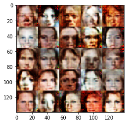


    Step 1405... Discriminator Loss: 1.3290... Generator Loss: 0.5560
    Step 1410... Discriminator Loss: 1.3303... Generator Loss: 0.7938
    Step 1415... Discriminator Loss: 1.4342... Generator Loss: 0.8367
    Step 1420... Discriminator Loss: 1.4690... Generator Loss: 0.7956
    Step 1425... Discriminator Loss: 1.4892... Generator Loss: 0.4821
    Step 1430... Discriminator Loss: 1.3668... Generator Loss: 0.7096
    Step 1435... Discriminator Loss: 1.3842... Generator Loss: 0.6506
    Step 1440... Discriminator Loss: 1.5150... Generator Loss: 0.4515
    Step 1445... Discriminator Loss: 1.3744... Generator Loss: 0.8416
    Step 1450... Discriminator Loss: 1.5432... Generator Loss: 0.4430
    Step 1455... Discriminator Loss: 1.2690... Generator Loss: 0.6926
    Step 1460... Discriminator Loss: 1.3999... Generator Loss: 0.8709
    Step 1465... Discriminator Loss: 1.3174... Generator Loss: 0.9722
    Step 1470... Discriminator Loss: 1.3371... Generator Loss: 0.7933
    Step 1475... Discriminator Loss: 1.4512... Generator Loss: 0.9672
    Step 1480... Discriminator Loss: 1.1864... Generator Loss: 0.8135
    Step 1485... Discriminator Loss: 1.2066... Generator Loss: 0.7090
    Step 1490... Discriminator Loss: 1.4231... Generator Loss: 0.5160
    Step 1495... Discriminator Loss: 1.4729... Generator Loss: 0.4140
    Step 1500... Discriminator Loss: 1.4769... Generator Loss: 0.6014


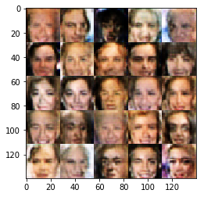


    Step 1505... Discriminator Loss: 1.4316... Generator Loss: 0.4771
    Step 1510... Discriminator Loss: 1.3744... Generator Loss: 1.0496
    Step 1515... Discriminator Loss: 1.4223... Generator Loss: 0.7737
    Step 1520... Discriminator Loss: 1.2386... Generator Loss: 0.8245
    Step 1525... Discriminator Loss: 1.2347... Generator Loss: 0.8507
    Step 1530... Discriminator Loss: 1.4438... Generator Loss: 0.5650
    Step 1535... Discriminator Loss: 1.3231... Generator Loss: 0.8341
    Step 1540... Discriminator Loss: 1.5424... Generator Loss: 1.3716
    Step 1545... Discriminator Loss: 1.3044... Generator Loss: 0.9168
    Step 1550... Discriminator Loss: 1.4409... Generator Loss: 0.5021
    Step 1555... Discriminator Loss: 1.2676... Generator Loss: 0.6229
    Step 1560... Discriminator Loss: 1.3154... Generator Loss: 0.7404
    Step 1565... Discriminator Loss: 1.3493... Generator Loss: 0.6416
    Step 1570... Discriminator Loss: 1.2271... Generator Loss: 0.9785
    Step 1575... Discriminator Loss: 1.4191... Generator Loss: 0.5129
    Step 1580... Discriminator Loss: 1.3027... Generator Loss: 0.8370
    Epoch 0... Discriminator Loss: 1.2412... Generator Loss: 0.7319


### Submitting This Project
When submitting this project, make sure to run all the cells before saving the notebook. Save the notebook file as "dlnd_face_generation.ipynb" and save it as a HTML file under "File" -> "Download as". Include the "helper.py" and "problem_unittests.py" files in your submission.
