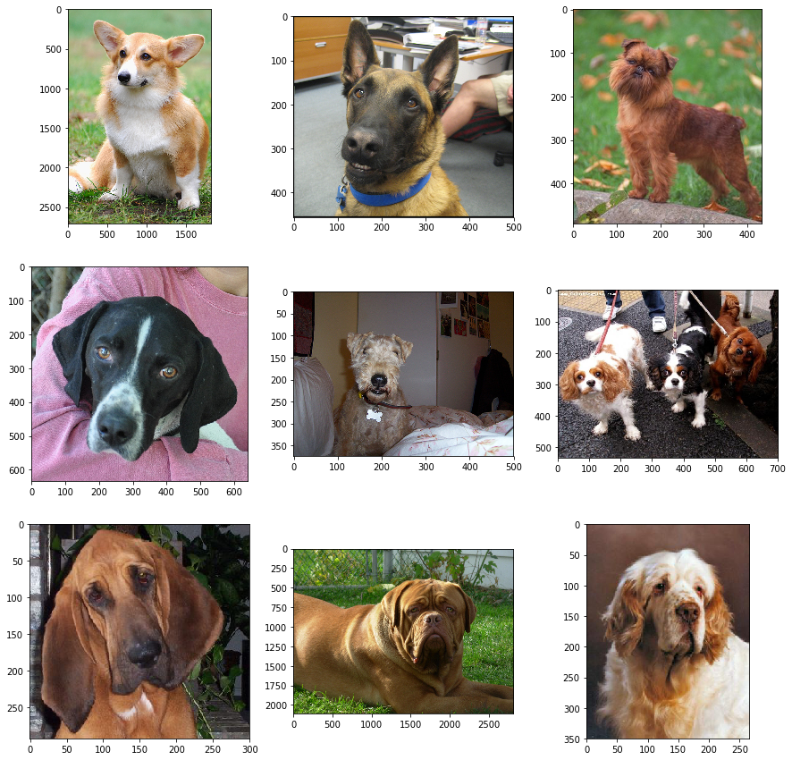

Title: Dog Breed Classification Using Transfer Learning
Date: 2018-06-02
Category: Image Classification, Deep Learning
Tags: Image Classification, Deep Learning, keras
Authors: Cihan Soylu


This notebook is part of my project submission for the Udacity Deep Learning Nano Degree program. The original github repository is [here](https://github.com/udacity/dog-project.git). The data can be found in that repository. Please download the dog images data and unzip in the same directory as this notebook is located.

**Note:** I strongly recommend using a GPU running this notebook. I have used a p2xlarge instance on AWS.


In this notebook we will use transfer learning to classify 133 dog breeds from 8351 images.

### Content

* [Step 0](#step0): Import Datasets
* [Step 1](#step1): Preprocess the data
* [Step 2](#step2): CNN from scratch
* [Step 3](#step3): CNN from scratch with data augmentation
* [Step 4](#step4): Get Bottleneck Features
* [Step 5](#step5): Create the model


---
<a id='step0'></a>
## Step 0: Import Datasets

### Import Dog Dataset

In the code cell below, we import a dataset of dog images.  We populate a few variables through the use of the `load_files` function from the scikit-learn library:
- `train_files`, `valid_files`, `test_files` - numpy arrays containing file paths to images
- `train_targets`, `valid_targets`, `test_targets` - numpy arrays containing onehot-encoded classification labels
- `dog_names` - list of string-valued dog breed names for translating labels


```python
from sklearn.datasets import load_files       
from keras.utils import np_utils
import numpy as np
from glob import glob

# define function to load train, test, and validation datasets
def load_dataset(path):
    data = load_files(path)
    dog_files = np.array(data['filenames'])
    dog_targets = np_utils.to_categorical(np.array(data['target']), 133)
    return dog_files, dog_targets

# load train, test, and validation datasets
train_files, train_targets = load_dataset('dogImages/train')
valid_files, valid_targets = load_dataset('dogImages/valid')
test_files, test_targets = load_dataset('dogImages/test')

# load list of dog names
dog_names = [item[20:-1] for item in sorted(glob("dogImages/train/*/"))]

# print statistics about the dataset
print('There are %d total dog categories.' % len(dog_names))
print('There are %s total dog images.\n' % len(np.hstack([train_files, valid_files, test_files])))
print('There are %d training dog images.' % len(train_files))
print('There are %d validation dog images.' % len(valid_files))
print('There are %d test dog images.'% len(test_files))
```

    There are 133 total dog categories.
    There are 8351 total dog images.

    There are 6680 training dog images.
    There are 835 validation dog images.
    There are 836 test dog images.


Now let's look at a few images from the dataset.  


```python
import matplotlib.pyplot as plt
import matplotlib.image as mpimg
%matplotlib inline                               

indices_to_show = np.random.randint(0, len(train_files), 9) #Choose 9 random indices.
fig, axes = plt.subplots(3, 3, figsize=(15,15))
for index, ax in zip(indices_to_show, axes.flatten()):
    img=mpimg.imread(train_files[index])
    ax.imshow(img)
```





<a id='step1'></a>
## Step 1: Preprocess the data
---
As you can see above, the images in the dataset comes in different sizes. So we need to preprocess the images so that they are all of the same size.

We will be using the pretrained [Xception](https://keras.io/applications/#xception) model from keras and as other pretrained models it requires a 4D tensor as input

$$
(\text{num_of_samples}, \text{rows}, \text{columns}, \text{channels}),
$$

where `num_of_samples` is the number of images, `rows` is the height of the image and `columns` is the width of the image, and `channels` is the channels of an image, e.g. 3 for RGB and 1 for GrayScale image.

The preprocessing is done by the `paths_to_tensors` function below.


```python
from keras.preprocessing import image
from tqdm import tqdm

def path_to_tensor(img_path):
    # loads RGB image as PIL.Image.Image type
    img = image.load_img(img_path, target_size=(224, 224))
    # convert PIL.Image.Image type to 3D tensor with shape (224, 224, 3)
    x = image.img_to_array(img)
    # convert 3D tensor to 4D tensor with shape (1, 224, 224, 3) and return 4D tensor
    return np.expand_dims(x, axis=0)

def paths_to_tensor(img_paths):
    list_of_tensors = [path_to_tensor(img_path) for img_path in tqdm(img_paths)]
    return np.vstack(list_of_tensors)

```


```python
from PIL import ImageFile                            
ImageFile.LOAD_TRUNCATED_IMAGES = True                 

# pre-process the data for Keras
train_tensors = paths_to_tensor(train_files).astype('float32')/255
valid_tensors = paths_to_tensor(valid_files).astype('float32')/255
test_tensors = paths_to_tensor(test_files).astype('float32')/255
```

    100%|██████████| 6680/6680 [00:54<00:00, 122.31it/s]
    100%|██████████| 835/835 [00:06<00:00, 136.52it/s]
    100%|██████████| 836/836 [00:06<00:00, 137.84it/s]


<a id='step2'></a>
## Step 2: CNN from scratch

Now we will train a CNN from scratch, so we will not use a pretrained model. The model we will use given below has 4 convolution-max pooling layers ending with a Global averaging layer followed by a dense layer.


```python
from keras.layers import Conv2D, MaxPooling2D, GlobalAveragePooling2D
from keras.layers import Dropout, Flatten, Dense
from keras.models import Sequential

model = Sequential()

model.add(Conv2D(filters = 32, kernel_size = 3, padding = 'valid', activation = 'relu', input_shape = (224, 224, 3)))
model.add(MaxPooling2D(pool_size=2))

model.add(Conv2D(filters=32, kernel_size=3, padding='valid', activation='relu'))
model.add(MaxPooling2D(pool_size=2))

model.add(Conv2D(filters=64, kernel_size=3, padding='valid', activation='relu'))
model.add(MaxPooling2D(pool_size=2))

model.add(Conv2D(filters=128, kernel_size=3, padding='valid', activation='relu'))
model.add(MaxPooling2D(pool_size=2))

model.add(GlobalAveragePooling2D())

model.add(Dense(256, activation = 'relu'))

model.add(Dense(133, activation = 'softmax'))

model.summary()
```

    _________________________________________________________________
    Layer (type)                 Output Shape              Param #   
    =================================================================
    conv2d_5 (Conv2D)            (None, 222, 222, 32)      896       
    _________________________________________________________________
    max_pooling2d_5 (MaxPooling2 (None, 111, 111, 32)      0         
    _________________________________________________________________
    conv2d_6 (Conv2D)            (None, 109, 109, 32)      9248      
    _________________________________________________________________
    max_pooling2d_6 (MaxPooling2 (None, 54, 54, 32)        0         
    _________________________________________________________________
    conv2d_7 (Conv2D)            (None, 52, 52, 64)        18496     
    _________________________________________________________________
    max_pooling2d_7 (MaxPooling2 (None, 26, 26, 64)        0         
    _________________________________________________________________
    conv2d_8 (Conv2D)            (None, 24, 24, 128)       73856     
    _________________________________________________________________
    max_pooling2d_8 (MaxPooling2 (None, 12, 12, 128)       0         
    _________________________________________________________________
    global_average_pooling2d_2 ( (None, 128)               0         
    _________________________________________________________________
    dense_3 (Dense)              (None, 256)               33024     
    _________________________________________________________________
    dense_4 (Dense)              (None, 133)               34181     
    =================================================================
    Total params: 169,701
    Trainable params: 169,701
    Non-trainable params: 0
    _________________________________________________________________


```python
model.compile(optimizer='rmsprop', loss='categorical_crossentropy', metrics=['accuracy'])
```

Below we will train the model and save the best weights to the folder "saved_models"


```python
from keras.callbacks import ModelCheckpoint  

epochs = 50
batch_size = 16

checkpointer = ModelCheckpoint(filepath='saved_models/weights.best.from_scratch.hdf5',
                               verbose=1, save_best_only=True)

model.fit(train_tensors, train_targets,
          validation_data=(valid_tensors, valid_targets),
          epochs=epochs, batch_size=batch_size, callbacks=[checkpointer], verbose=1)
```

    Train on 6680 samples, validate on 835 samples
    Epoch 1/50
    6680/6680 [==============================] - 19s 3ms/step - loss: 4.8840 - acc: 0.0061 - val_loss: 4.8740 - val_acc: 0.0108

    Epoch 00001: val_loss improved from inf to 4.87396, saving model to saved_models/weights.best.from_scratch.hdf5
    Epoch 2/50
    6680/6680 [==============================] - 19s 3ms/step - loss: 4.8477 - acc: 0.0126 - val_loss: 4.7735 - val_acc: 0.0216

    Epoch 00002: val_loss improved from 4.87396 to 4.77349, saving model to saved_models/weights.best.from_scratch.hdf5
    Epoch 3/50
    6680/6680 [==============================] - 19s 3ms/step - loss: 4.7265 - acc: 0.0228 - val_loss: 4.7130 - val_acc: 0.0263

    Epoch 00003: val_loss improved from 4.77349 to 4.71300, saving model to saved_models/weights.best.from_scratch.hdf5
    Epoch 4/50
    6680/6680 [==============================] - 19s 3ms/step - loss: 4.6109 - acc: 0.0308 - val_loss: 4.5390 - val_acc: 0.0407

    Epoch 00004: val_loss improved from 4.71300 to 4.53896, saving model to saved_models/weights.best.from_scratch.hdf5
    Epoch 5/50
    6680/6680 [==============================] - 19s 3ms/step - loss: 4.4777 - acc: 0.0437 - val_loss: 4.5030 - val_acc: 0.0443

    Epoch 00005: val_loss improved from 4.53896 to 4.50295, saving model to saved_models/weights.best.from_scratch.hdf5
    Epoch 6/50
    6680/6680 [==============================] - 19s 3ms/step - loss: 4.3478 - acc: 0.0543 - val_loss: 4.3964 - val_acc: 0.0491

    Epoch 00006: val_loss improved from 4.50295 to 4.39635, saving model to saved_models/weights.best.from_scratch.hdf5
    Epoch 7/50
    6680/6680 [==============================] - 19s 3ms/step - loss: 4.2199 - acc: 0.0684 - val_loss: 4.2825 - val_acc: 0.0575

    Epoch 00007: val_loss improved from 4.39635 to 4.28255, saving model to saved_models/weights.best.from_scratch.hdf5
    Epoch 8/50
    6680/6680 [==============================] - 19s 3ms/step - loss: 4.1094 - acc: 0.0725 - val_loss: 4.3338 - val_acc: 0.0395

    Epoch 00008: val_loss did not improve
    Epoch 9/50
    6680/6680 [==============================] - 19s 3ms/step - loss: 3.9991 - acc: 0.0867 - val_loss: 4.4765 - val_acc: 0.0431

    Epoch 00009: val_loss did not improve
    Epoch 10/50
    6680/6680 [==============================] - 19s 3ms/step - loss: 3.9055 - acc: 0.0981 - val_loss: 3.9514 - val_acc: 0.0778

    Epoch 00010: val_loss improved from 4.28255 to 3.95144, saving model to saved_models/weights.best.from_scratch.hdf5
    Epoch 11/50
    6680/6680 [==============================] - 19s 3ms/step - loss: 3.7959 - acc: 0.1138 - val_loss: 3.9656 - val_acc: 0.0898

    Epoch 00011: val_loss did not improve
    Epoch 12/50
    6680/6680 [==============================] - 19s 3ms/step - loss: 3.6930 - acc: 0.1266 - val_loss: 3.7596 - val_acc: 0.1102

    Epoch 00012: val_loss improved from 3.95144 to 3.75957, saving model to saved_models/weights.best.from_scratch.hdf5
    Epoch 13/50
    6680/6680 [==============================] - 19s 3ms/step - loss: 3.5994 - acc: 0.1401 - val_loss: 3.9008 - val_acc: 0.1042

    Epoch 00013: val_loss did not improve
    Epoch 14/50
    6680/6680 [==============================] - 19s 3ms/step - loss: 3.5163 - acc: 0.1504 - val_loss: 3.9056 - val_acc: 0.1006

    Epoch 00014: val_loss did not improve
    Epoch 15/50
    6680/6680 [==============================] - 19s 3ms/step - loss: 3.4212 - acc: 0.1669 - val_loss: 3.6614 - val_acc: 0.1210

    Epoch 00015: val_loss improved from 3.75957 to 3.66142, saving model to saved_models/weights.best.from_scratch.hdf5
    Epoch 16/50
    6680/6680 [==============================] - 19s 3ms/step - loss: 3.3370 - acc: 0.1751 - val_loss: 3.7421 - val_acc: 0.1389

    Epoch 00016: val_loss did not improve
    Epoch 17/50
    6680/6680 [==============================] - 19s 3ms/step - loss: 3.2583 - acc: 0.1940 - val_loss: 3.5657 - val_acc: 0.1222

    Epoch 00017: val_loss improved from 3.66142 to 3.56569, saving model to saved_models/weights.best.from_scratch.hdf5
    Epoch 18/50
    6680/6680 [==============================] - 19s 3ms/step - loss: 3.1796 - acc: 0.2117 - val_loss: 3.6853 - val_acc: 0.1317

    Epoch 00018: val_loss did not improve
    Epoch 19/50
    6680/6680 [==============================] - 19s 3ms/step - loss: 3.1112 - acc: 0.2190 - val_loss: 3.4688 - val_acc: 0.1641

    Epoch 00019: val_loss improved from 3.56569 to 3.46879, saving model to saved_models/weights.best.from_scratch.hdf5
    Epoch 20/50
    6680/6680 [==============================] - 19s 3ms/step - loss: 3.0268 - acc: 0.2356 - val_loss: 3.6024 - val_acc: 0.1365

    Epoch 00020: val_loss did not improve
    Epoch 21/50
    6680/6680 [==============================] - 19s 3ms/step - loss: 2.9560 - acc: 0.2425 - val_loss: 3.6038 - val_acc: 0.1677

    Epoch 00021: val_loss did not improve
    Epoch 22/50
    6680/6680 [==============================] - 19s 3ms/step - loss: 2.8959 - acc: 0.2680 - val_loss: 3.2961 - val_acc: 0.1904

    Epoch 00022: val_loss improved from 3.46879 to 3.29614, saving model to saved_models/weights.best.from_scratch.hdf5
    Epoch 23/50
    6680/6680 [==============================] - 19s 3ms/step - loss: 2.8170 - acc: 0.2677 - val_loss: 3.3849 - val_acc: 0.1820

    Epoch 00023: val_loss did not improve
    Epoch 24/50
    6680/6680 [==============================] - 19s 3ms/step - loss: 2.7472 - acc: 0.2876 - val_loss: 3.5584 - val_acc: 0.1461

    Epoch 00024: val_loss did not improve
    Epoch 25/50
    6680/6680 [==============================] - 19s 3ms/step - loss: 2.6864 - acc: 0.3066 - val_loss: 3.7654 - val_acc: 0.1593

    Epoch 00025: val_loss did not improve
    Epoch 26/50
    6680/6680 [==============================] - 19s 3ms/step - loss: 2.6007 - acc: 0.3184 - val_loss: 3.4152 - val_acc: 0.2000

    Epoch 00026: val_loss did not improve
    Epoch 27/50
    6680/6680 [==============================] - 19s 3ms/step - loss: 2.5302 - acc: 0.3257 - val_loss: 3.6059 - val_acc: 0.2048

    Epoch 00027: val_loss did not improve
    Epoch 28/50
    6680/6680 [==============================] - 19s 3ms/step - loss: 2.4638 - acc: 0.3472 - val_loss: 3.7669 - val_acc: 0.1629

    Epoch 00028: val_loss did not improve
    Epoch 29/50
    6680/6680 [==============================] - 19s 3ms/step - loss: 2.4092 - acc: 0.3584 - val_loss: 3.1557 - val_acc: 0.2419

    Epoch 00029: val_loss improved from 3.29614 to 3.15567, saving model to saved_models/weights.best.from_scratch.hdf5
    Epoch 30/50
    6680/6680 [==============================] - 19s 3ms/step - loss: 2.3170 - acc: 0.3762 - val_loss: 3.3658 - val_acc: 0.2144

    Epoch 00030: val_loss did not improve
    Epoch 31/50
    6680/6680 [==============================] - 19s 3ms/step - loss: 2.2627 - acc: 0.3871 - val_loss: 3.3313 - val_acc: 0.2275

    Epoch 00031: val_loss did not improve
    Epoch 32/50
    6680/6680 [==============================] - 19s 3ms/step - loss: 2.1984 - acc: 0.4028 - val_loss: 3.7455 - val_acc: 0.1784

    Epoch 00032: val_loss did not improve
    Epoch 33/50
    6680/6680 [==============================] - 19s 3ms/step - loss: 2.1346 - acc: 0.4198 - val_loss: 3.7559 - val_acc: 0.2168

    Epoch 00033: val_loss did not improve
    Epoch 34/50
    6680/6680 [==============================] - 19s 3ms/step - loss: 2.0732 - acc: 0.4395 - val_loss: 3.6915 - val_acc: 0.2527

    Epoch 00034: val_loss did not improve
    Epoch 35/50
    6680/6680 [==============================] - 19s 3ms/step - loss: 2.0041 - acc: 0.4434 - val_loss: 3.5521 - val_acc: 0.2251

    Epoch 00035: val_loss did not improve
    Epoch 36/50
    6680/6680 [==============================] - 19s 3ms/step - loss: 1.9364 - acc: 0.4590 - val_loss: 3.6789 - val_acc: 0.2216

    Epoch 00036: val_loss did not improve
    Epoch 37/50
    6680/6680 [==============================] - 19s 3ms/step - loss: 1.8862 - acc: 0.4789 - val_loss: 3.3007 - val_acc: 0.2683

    Epoch 00037: val_loss did not improve
    Epoch 38/50
    6680/6680 [==============================] - 19s 3ms/step - loss: 1.8216 - acc: 0.4867 - val_loss: 3.9795 - val_acc: 0.2108

    Epoch 00038: val_loss did not improve
    Epoch 39/50
    6680/6680 [==============================] - 19s 3ms/step - loss: 1.7672 - acc: 0.5048 - val_loss: 3.4852 - val_acc: 0.2216

    Epoch 00039: val_loss did not improve
    Epoch 40/50
    6680/6680 [==============================] - 19s 3ms/step - loss: 1.6889 - acc: 0.5217 - val_loss: 3.9316 - val_acc: 0.2335

    Epoch 00040: val_loss did not improve
    Epoch 41/50
    6680/6680 [==============================] - 19s 3ms/step - loss: 1.6499 - acc: 0.5253 - val_loss: 3.5624 - val_acc: 0.2407

    Epoch 00041: val_loss did not improve
    Epoch 42/50
    6680/6680 [==============================] - 19s 3ms/step - loss: 1.5971 - acc: 0.5436 - val_loss: 3.9902 - val_acc: 0.2479

    Epoch 00042: val_loss did not improve
    Epoch 43/50
    6680/6680 [==============================] - 19s 3ms/step - loss: 1.5496 - acc: 0.5515 - val_loss: 3.8069 - val_acc: 0.2778

    Epoch 00043: val_loss did not improve
    Epoch 44/50
    6680/6680 [==============================] - 19s 3ms/step - loss: 1.4886 - acc: 0.5690 - val_loss: 3.9546 - val_acc: 0.2599

    Epoch 00044: val_loss did not improve
    Epoch 45/50
    6680/6680 [==============================] - 19s 3ms/step - loss: 1.4387 - acc: 0.5837 - val_loss: 3.6427 - val_acc: 0.2551

    Epoch 00045: val_loss did not improve
    Epoch 46/50
    6680/6680 [==============================] - 19s 3ms/step - loss: 1.3905 - acc: 0.5897 - val_loss: 3.3291 - val_acc: 0.2754

    Epoch 00046: val_loss did not improve
    Epoch 47/50
    6680/6680 [==============================] - 19s 3ms/step - loss: 1.3485 - acc: 0.6042 - val_loss: 3.9535 - val_acc: 0.2611

    Epoch 00047: val_loss did not improve
    Epoch 48/50
    6680/6680 [==============================] - 19s 3ms/step - loss: 1.2669 - acc: 0.6220 - val_loss: 4.0364 - val_acc: 0.2731

    Epoch 00048: val_loss did not improve
    Epoch 49/50
    6680/6680 [==============================] - 19s 3ms/step - loss: 1.2353 - acc: 0.6326 - val_loss: 4.2177 - val_acc: 0.2587

    Epoch 00049: val_loss did not improve
    Epoch 50/50
    6680/6680 [==============================] - 19s 3ms/step - loss: 1.1902 - acc: 0.6443 - val_loss: 4.0042 - val_acc: 0.2527

    Epoch 00050: val_loss did not improve


    <keras.callbacks.History at 0x7fe370b54da0>


```python
model.load_weights('saved_models/weights.best.from_scratch.hdf5')
```


```python
# get index of predicted dog breed for each image in test set
dog_breed_predictions = [np.argmax(model.predict(np.expand_dims(tensor, axis=0))) for tensor in test_tensors]

# report test accuracy
test_accuracy = 100*np.sum(np.array(dog_breed_predictions)==np.argmax(test_targets, axis=1))/len(dog_breed_predictions)
print('Test accuracy: %.4f%%' % test_accuracy)
```

    Test accuracy: 25.7177%


We get 25% test accuracy. It might not seem so high but you should take into account that there are 133 dog breeds in the dataset and so random guessing would have the accuracy of 1/133 = 0.0075 = 0.75%. However as we will see below using transfer learning we can get a much better accuracy. Before that we will use data augmentation and train the same model again to see where that get us.

<a id='step3'></a>
## Step 3: CNN from scratch with data augmentation


```python
from keras.layers import Conv2D, MaxPooling2D, GlobalAveragePooling2D
from keras.layers import Dropout, Flatten, Dense
from keras.models import Sequential

model = Sequential()

model.add(Conv2D(filters = 32, kernel_size = 3, padding = 'valid', activation = 'relu', input_shape = (224, 224, 3)))
model.add(MaxPooling2D(pool_size=2))

model.add(Conv2D(filters=32, kernel_size=3, padding='valid', activation='relu'))
model.add(MaxPooling2D(pool_size=2))

model.add(Conv2D(filters=64, kernel_size=3, padding='valid', activation='relu'))
model.add(MaxPooling2D(pool_size=2))

model.add(Conv2D(filters=128, kernel_size=3, padding='valid', activation='relu'))
model.add(MaxPooling2D(pool_size=2))

model.add(GlobalAveragePooling2D())

model.add(Dense(256, activation = 'relu'))

model.add(Dense(133, activation = 'softmax'))
```


```python
model.compile(optimizer='rmsprop', loss='categorical_crossentropy', metrics=['accuracy'])
```


```python
from keras.preprocessing.image import ImageDataGenerator

batch_size = 16

train_datagen = ImageDataGenerator(
        rescale=1./255,
        shear_range=0.2,
        zoom_range=0.2,
        rotation_range=20,
        width_shift_range=0.2,
        height_shift_range=0.2,
        horizontal_flip=True)

# only rescaling for the test data
valid_datagen = ImageDataGenerator(rescale=1./255)

# this is a generator that will read pictures found in
# subfolers of 'data/train', and indefinitely generate
# batches of augmented image data
train_generator = train_datagen.flow_from_directory(
        'dogImages/train',  # this is the target directory
        target_size=(224, 224),  # all images will be resized to 150x150
        batch_size=batch_size,
        class_mode='categorical')  # since we use binary_crossentropy loss, we need binary labels

# this is a similar generator, for validation data
validation_generator = valid_datagen.flow_from_directory(
        'dogImages/valid',
        target_size=(224, 224),
        batch_size=batch_size,
        class_mode='categorical')
```

    Found 6680 images belonging to 133 classes.
    Found 835 images belonging to 133 classes.


```python
from keras.callbacks import ModelCheckpoint  

epochs = 50

checkpointer = ModelCheckpoint(filepath='saved_models/weights.best.from_scratch.with_data_augmentation.hdf5',
                               verbose=1, save_best_only=True)


# In order to use the above data generators I used fit_generator function.
model.fit_generator(train_generator,
          steps_per_epoch = len(train_files) // batch_size,
          validation_data=validation_generator,
          validation_steps = len(valid_files) // batch_size,
          epochs=epochs, callbacks=[checkpointer], verbose=1)
```

    Epoch 1/50
    417/417 [==============================] - 133s 320ms/step - loss: 4.8848 - acc: 0.0090 - val_loss: 4.8690 - val_acc: 0.0108

    Epoch 00001: val_loss improved from inf to 4.86899, saving model to saved_models/weights.best.from_scratch.with_data_augmentation.hdf5
    Epoch 2/50
    417/417 [==============================] - 134s 321ms/step - loss: 4.8692 - acc: 0.0115 - val_loss: 4.8399 - val_acc: 0.0120

    Epoch 00002: val_loss improved from 4.86899 to 4.83987, saving model to saved_models/weights.best.from_scratch.with_data_augmentation.hdf5
    Epoch 3/50
    417/417 [==============================] - 131s 315ms/step - loss: 4.7948 - acc: 0.0172 - val_loss: 4.7173 - val_acc: 0.0252

    Epoch 00003: val_loss improved from 4.83987 to 4.71729, saving model to saved_models/weights.best.from_scratch.with_data_augmentation.hdf5
    Epoch 4/50
    417/417 [==============================] - 133s 320ms/step - loss: 4.6929 - acc: 0.0229 - val_loss: 4.6181 - val_acc: 0.0312

    Epoch 00004: val_loss improved from 4.71729 to 4.61807, saving model to saved_models/weights.best.from_scratch.with_data_augmentation.hdf5
    Epoch 5/50
    417/417 [==============================] - 132s 318ms/step - loss: 4.6009 - acc: 0.0286 - val_loss: 4.5195 - val_acc: 0.0409

    Epoch 00005: val_loss improved from 4.61807 to 4.51954, saving model to saved_models/weights.best.from_scratch.with_data_augmentation.hdf5
    Epoch 6/50
    417/417 [==============================] - 132s 316ms/step - loss: 4.5144 - acc: 0.0337 - val_loss: 4.4668 - val_acc: 0.0325

    Epoch 00006: val_loss improved from 4.51954 to 4.46682, saving model to saved_models/weights.best.from_scratch.with_data_augmentation.hdf5
    Epoch 7/50
    417/417 [==============================] - 133s 320ms/step - loss: 4.4645 - acc: 0.0361 - val_loss: 4.4660 - val_acc: 0.0385

    Epoch 00007: val_loss improved from 4.46682 to 4.46596, saving model to saved_models/weights.best.from_scratch.with_data_augmentation.hdf5
    Epoch 8/50
    417/417 [==============================] - 132s 316ms/step - loss: 4.3970 - acc: 0.0445 - val_loss: 4.4072 - val_acc: 0.0457

    Epoch 00008: val_loss improved from 4.46596 to 4.40720, saving model to saved_models/weights.best.from_scratch.with_data_augmentation.hdf5
    Epoch 9/50
    417/417 [==============================] - 131s 315ms/step - loss: 4.3251 - acc: 0.0523 - val_loss: 4.5975 - val_acc: 0.0433

    Epoch 00009: val_loss did not improve
    Epoch 10/50
    417/417 [==============================] - 132s 316ms/step - loss: 4.2500 - acc: 0.0600 - val_loss: 4.1879 - val_acc: 0.0733

    Epoch 00010: val_loss improved from 4.40720 to 4.18790, saving model to saved_models/weights.best.from_scratch.with_data_augmentation.hdf5
    Epoch 11/50
    417/417 [==============================] - 132s 316ms/step - loss: 4.1487 - acc: 0.0715 - val_loss: 4.1497 - val_acc: 0.0913

    Epoch 00011: val_loss improved from 4.18790 to 4.14967, saving model to saved_models/weights.best.from_scratch.with_data_augmentation.hdf5
    Epoch 12/50
    417/417 [==============================] - 131s 314ms/step - loss: 4.0652 - acc: 0.0785 - val_loss: 4.0355 - val_acc: 0.0986

    Epoch 00012: val_loss improved from 4.14967 to 4.03548, saving model to saved_models/weights.best.from_scratch.with_data_augmentation.hdf5
    Epoch 13/50
    417/417 [==============================] - 132s 317ms/step - loss: 3.9748 - acc: 0.0929 - val_loss: 4.0446 - val_acc: 0.0901

    Epoch 00013: val_loss did not improve
    Epoch 14/50
    417/417 [==============================] - 130s 311ms/step - loss: 3.8793 - acc: 0.1024 - val_loss: 4.1050 - val_acc: 0.0865

    Epoch 00014: val_loss did not improve
    Epoch 15/50
    417/417 [==============================] - 131s 313ms/step - loss: 3.7889 - acc: 0.1138 - val_loss: 3.8874 - val_acc: 0.1178

    Epoch 00015: val_loss improved from 4.03548 to 3.88744, saving model to saved_models/weights.best.from_scratch.with_data_augmentation.hdf5
    Epoch 16/50
    417/417 [==============================] - 130s 311ms/step - loss: 3.7240 - acc: 0.1250 - val_loss: 3.7508 - val_acc: 0.1250

    Epoch 00016: val_loss improved from 3.88744 to 3.75082, saving model to saved_models/weights.best.from_scratch.with_data_augmentation.hdf5
    Epoch 17/50
    417/417 [==============================] - 133s 318ms/step - loss: 3.6359 - acc: 0.1370 - val_loss: 3.7449 - val_acc: 0.1238

    Epoch 00017: val_loss improved from 3.75082 to 3.74486, saving model to saved_models/weights.best.from_scratch.with_data_augmentation.hdf5
    Epoch 18/50
    417/417 [==============================] - 130s 312ms/step - loss: 3.5708 - acc: 0.1515 - val_loss: 3.6314 - val_acc: 0.1490

    Epoch 00018: val_loss improved from 3.74486 to 3.63145, saving model to saved_models/weights.best.from_scratch.with_data_augmentation.hdf5
    Epoch 19/50
    417/417 [==============================] - 131s 315ms/step - loss: 3.4741 - acc: 0.1551 - val_loss: 3.6131 - val_acc: 0.1623

    Epoch 00019: val_loss improved from 3.63145 to 3.61307, saving model to saved_models/weights.best.from_scratch.with_data_augmentation.hdf5
    Epoch 20/50
    417/417 [==============================] - 131s 315ms/step - loss: 3.4263 - acc: 0.1697 - val_loss: 3.6006 - val_acc: 0.1298

    Epoch 00020: val_loss improved from 3.61307 to 3.60061, saving model to saved_models/weights.best.from_scratch.with_data_augmentation.hdf5
    Epoch 21/50
    417/417 [==============================] - 131s 315ms/step - loss: 3.3838 - acc: 0.1755 - val_loss: 3.5495 - val_acc: 0.1490

    Epoch 00021: val_loss improved from 3.60061 to 3.54951, saving model to saved_models/weights.best.from_scratch.with_data_augmentation.hdf5
    Epoch 22/50
    417/417 [==============================] - 132s 316ms/step - loss: 3.3180 - acc: 0.1853 - val_loss: 3.5241 - val_acc: 0.1683

    Epoch 00022: val_loss improved from 3.54951 to 3.52405, saving model to saved_models/weights.best.from_scratch.with_data_augmentation.hdf5
    Epoch 23/50
    417/417 [==============================] - 130s 313ms/step - loss: 3.2447 - acc: 0.1917 - val_loss: 3.4335 - val_acc: 0.1911

    Epoch 00023: val_loss improved from 3.52405 to 3.43355, saving model to saved_models/weights.best.from_scratch.with_data_augmentation.hdf5
    Epoch 24/50
    417/417 [==============================] - 131s 315ms/step - loss: 3.2162 - acc: 0.2020 - val_loss: 3.4402 - val_acc: 0.1911

    Epoch 00024: val_loss did not improve
    Epoch 25/50
    417/417 [==============================] - 130s 311ms/step - loss: 3.1586 - acc: 0.2131 - val_loss: 3.4755 - val_acc: 0.1587

    Epoch 00025: val_loss did not improve
    Epoch 26/50
    417/417 [==============================] - 134s 322ms/step - loss: 3.1057 - acc: 0.2253 - val_loss: 3.2875 - val_acc: 0.2031

    Epoch 00026: val_loss improved from 3.43355 to 3.28749, saving model to saved_models/weights.best.from_scratch.with_data_augmentation.hdf5
    Epoch 27/50
    417/417 [==============================] - 132s 316ms/step - loss: 3.0740 - acc: 0.2275 - val_loss: 3.2023 - val_acc: 0.2139

    Epoch 00027: val_loss improved from 3.28749 to 3.20235, saving model to saved_models/weights.best.from_scratch.with_data_augmentation.hdf5
    Epoch 28/50
    417/417 [==============================] - 133s 319ms/step - loss: 3.0266 - acc: 0.2362 - val_loss: 3.1934 - val_acc: 0.2212

    Epoch 00028: val_loss improved from 3.20235 to 3.19342, saving model to saved_models/weights.best.from_scratch.with_data_augmentation.hdf5
    Epoch 29/50
    417/417 [==============================] - 130s 313ms/step - loss: 2.9687 - acc: 0.2487 - val_loss: 3.0956 - val_acc: 0.2212

    Epoch 00029: val_loss improved from 3.19342 to 3.09558, saving model to saved_models/weights.best.from_scratch.with_data_augmentation.hdf5
    Epoch 30/50
    417/417 [==============================] - 131s 314ms/step - loss: 2.9195 - acc: 0.2540 - val_loss: 3.1874 - val_acc: 0.2103

    Epoch 00030: val_loss did not improve
    Epoch 31/50
    417/417 [==============================] - 132s 315ms/step - loss: 2.8855 - acc: 0.2630 - val_loss: 3.2581 - val_acc: 0.2188

    Epoch 00031: val_loss did not improve
    Epoch 32/50
    417/417 [==============================] - 131s 314ms/step - loss: 2.8559 - acc: 0.2656 - val_loss: 3.0971 - val_acc: 0.2368

    Epoch 00032: val_loss did not improve
    Epoch 33/50
    417/417 [==============================] - 132s 316ms/step - loss: 2.7907 - acc: 0.2801 - val_loss: 3.0625 - val_acc: 0.2488

    Epoch 00033: val_loss improved from 3.09558 to 3.06251, saving model to saved_models/weights.best.from_scratch.with_data_augmentation.hdf5
    Epoch 34/50
    417/417 [==============================] - 131s 314ms/step - loss: 2.7643 - acc: 0.2885 - val_loss: 2.9934 - val_acc: 0.2752

    Epoch 00034: val_loss improved from 3.06251 to 2.99344, saving model to saved_models/weights.best.from_scratch.with_data_augmentation.hdf5
    Epoch 35/50
    417/417 [==============================] - 134s 320ms/step - loss: 2.7335 - acc: 0.2932 - val_loss: 2.9167 - val_acc: 0.2716

    Epoch 00035: val_loss improved from 2.99344 to 2.91671, saving model to saved_models/weights.best.from_scratch.with_data_augmentation.hdf5
    Epoch 36/50
    417/417 [==============================] - 130s 313ms/step - loss: 2.7056 - acc: 0.3109 - val_loss: 3.1211 - val_acc: 0.2452

    Epoch 00036: val_loss did not improve
    Epoch 37/50
    417/417 [==============================] - 131s 315ms/step - loss: 2.6680 - acc: 0.3101 - val_loss: 3.3192 - val_acc: 0.2188

    Epoch 00037: val_loss did not improve
    Epoch 38/50
    417/417 [==============================] - 131s 313ms/step - loss: 2.6243 - acc: 0.3176 - val_loss: 2.9964 - val_acc: 0.2500

    Epoch 00038: val_loss did not improve
    Epoch 39/50
    417/417 [==============================] - 132s 316ms/step - loss: 2.6324 - acc: 0.3177 - val_loss: 2.8312 - val_acc: 0.2752

    Epoch 00039: val_loss improved from 2.91671 to 2.83120, saving model to saved_models/weights.best.from_scratch.with_data_augmentation.hdf5
    Epoch 40/50
    417/417 [==============================] - 131s 314ms/step - loss: 2.5588 - acc: 0.3267 - val_loss: 3.0950 - val_acc: 0.2620

    Epoch 00040: val_loss did not improve
    Epoch 41/50
    417/417 [==============================] - 131s 313ms/step - loss: 2.5578 - acc: 0.3332 - val_loss: 2.9161 - val_acc: 0.3053

    Epoch 00041: val_loss did not improve
    Epoch 42/50
    417/417 [==============================] - 131s 314ms/step - loss: 2.4982 - acc: 0.3468 - val_loss: 2.8159 - val_acc: 0.3077

    Epoch 00042: val_loss improved from 2.83120 to 2.81593, saving model to saved_models/weights.best.from_scratch.with_data_augmentation.hdf5
    Epoch 43/50
    417/417 [==============================] - 131s 315ms/step - loss: 2.5189 - acc: 0.3437 - val_loss: 2.7481 - val_acc: 0.3029

    Epoch 00043: val_loss improved from 2.81593 to 2.74815, saving model to saved_models/weights.best.from_scratch.with_data_augmentation.hdf5
    Epoch 44/50
    417/417 [==============================] - 131s 313ms/step - loss: 2.4499 - acc: 0.3543 - val_loss: 2.9970 - val_acc: 0.2704

    Epoch 00044: val_loss did not improve
    Epoch 45/50
    417/417 [==============================] - 133s 319ms/step - loss: 2.4438 - acc: 0.3492 - val_loss: 2.8313 - val_acc: 0.3029

    Epoch 00045: val_loss did not improve
    Epoch 46/50
    417/417 [==============================] - 130s 313ms/step - loss: 2.4102 - acc: 0.3624 - val_loss: 2.9929 - val_acc: 0.2812

    Epoch 00046: val_loss did not improve
    Epoch 47/50
    417/417 [==============================] - 131s 315ms/step - loss: 2.3677 - acc: 0.3654 - val_loss: 2.9857 - val_acc: 0.2849

    Epoch 00047: val_loss did not improve
    Epoch 48/50
    417/417 [==============================] - 131s 313ms/step - loss: 2.3655 - acc: 0.3696 - val_loss: 2.9012 - val_acc: 0.2921

    Epoch 00048: val_loss did not improve
    Epoch 49/50
    417/417 [==============================] - 130s 312ms/step - loss: 2.3595 - acc: 0.3708 - val_loss: 2.8420 - val_acc: 0.3149

    Epoch 00049: val_loss did not improve
    Epoch 50/50
    417/417 [==============================] - 131s 314ms/step - loss: 2.3087 - acc: 0.3823 - val_loss: 2.7264 - val_acc: 0.3353

    Epoch 00050: val_loss improved from 2.74815 to 2.72642, saving model to saved_models/weights.best.from_scratch.with_data_augmentation.hdf5


    <keras.callbacks.History at 0x7fe36832db38>


```python
model.load_weights('saved_models/weights.best.from_scratch.with_data_augmentation.hdf5')
```


```python
# get index of predicted dog breed for each image in test set
dog_breed_predictions = [np.argmax(model.predict(np.expand_dims(tensor, axis=0))) for tensor in test_tensors]

# report test accuracy
test_accuracy = 100*np.sum(np.array(dog_breed_predictions)==np.argmax(test_targets, axis=1))/len(dog_breed_predictions)
print('Test accuracy: %.4f%%' % test_accuracy)
```

    Test accuracy: 29.6651%


The test accuracy using data augmentation improved from 25% to almost 30%.

<a id='step4'></a>
## Step 4: Get Bottleneck Features
---
Now we will use transfer learning for this classification problem. After experimenting with other [models](https://keras.io/applications/) I have decided to use Xception for this problem. Now we will get the bottleneck features for the xception model and save it in the folder `bottleneck_features` for future use so that you don't have to run this step everytime.

**Note:** For getting the bottleneck features, I recommend using a GPU but you can run the steps after that on a CPU (depending on the complexity of your model).


```python
from keras.applications.xception import preprocess_input, Xception
from tqdm import tqdm

model = Xception(include_top = False, weights = 'imagenet')

def bottleneck_features(img_paths):
    img_inputs = preprocess_input(paths_to_tensor(tqdm(img_paths)))
    return model.predict(img_inputs)
```


```python
from PIL import ImageFile                            
ImageFile.LOAD_TRUNCATED_IMAGES = True  

train_bottleneck = bottleneck_features(train_files)
valid_bottleneck = bottleneck_features(valid_files)
test_bottleneck = bottleneck_features(test_files)
```

    100%|██████████| 6680/6680 [00:54<00:00, 123.64it/s]
    100%|██████████| 835/835 [00:05<00:00, 140.39it/s]
    100%|██████████| 836/836 [00:05<00:00, 139.98it/s]


```python
np.savez('bottleneck_features/bottleneck_features_xception', train=train_bottleneck, valid = valid_bottleneck, test = test_bottleneck)
```

<a id='step5'></a>
## Step 5: Create the model
---
Now we will create a model which takes the bottleneck features as its input. For this model I have simply used a Global averaging layer together with a Dropout layer. Feel free to play with other architectures. The point of the global averaging layer is to reduce the number of parameters to reduce the complexity and also to make the training easier.


```python
bottleneck_features = np.load('bottleneck_features/bottleneck_features_xception.npz')
train_bottleneck = bottleneck_features['train']
valid_bottleneck = bottleneck_features['valid']
test_bottleneck = bottleneck_features['test']
```


```python
from keras.layers import Conv2D, MaxPooling2D, GlobalAveragePooling2D
from keras.layers import Dropout, Flatten, Dense
from keras.models import Sequential

Xception_model = Sequential()
Xception_model.add(GlobalAveragePooling2D(input_shape=train_bottleneck.shape[1:]))
Xception_model.add(Dropout(0.3))
Xception_model.add(Dense(133, activation='softmax'))

Xception_model.summary()
```

    _________________________________________________________________
    Layer (type)                 Output Shape              Param #   
    =================================================================
    global_average_pooling2d_9 ( (None, 2048)              0         
    _________________________________________________________________
    dropout_1 (Dropout)          (None, 2048)              0         
    _________________________________________________________________
    dense_9 (Dense)              (None, 133)               272517    
    =================================================================
    Total params: 272,517
    Trainable params: 272,517
    Non-trainable params: 0
    _________________________________________________________________


```python
learning_rate = 0.0001
epochs = 100
batch_size = 64
```


```python
from keras import optimizers

rmsprop_optimizer = optimizers.RMSprop(lr=learning_rate)

Xception_model.compile(loss='categorical_crossentropy', optimizer = rmsprop_optimizer, metrics=['accuracy'])
```


```python
from keras.callbacks import ModelCheckpoint  

checkpointer = ModelCheckpoint(filepath='saved_models/weights.best.Xception.hdf5',
                               verbose=1, save_best_only=True)

Xception_model.fit(train_bottleneck, train_targets,
          validation_data=(valid_bottleneck, valid_targets),
          epochs=epochs, batch_size=batch_size, callbacks=[checkpointer], verbose=1)
```

    Train on 6680 samples, validate on 835 samples
    Epoch 1/100
    6680/6680 [==============================] - 5s 696us/step - loss: 4.2058 - acc: 0.1754 - val_loss: 3.4023 - val_acc: 0.5066

    Epoch 00001: val_loss improved from inf to 3.40226, saving model to saved_models/weights.best.Xception.hdf5
    Epoch 2/100
    6680/6680 [==============================] - 3s 420us/step - loss: 2.8179 - acc: 0.5701 - val_loss: 2.2503 - val_acc: 0.6922

    Epoch 00002: val_loss improved from 3.40226 to 2.25028, saving model to saved_models/weights.best.Xception.hdf5
    Epoch 3/100
    6680/6680 [==============================] - 3s 401us/step - loss: 1.8449 - acc: 0.7168 - val_loss: 1.5213 - val_acc: 0.7461

    Epoch 00003: val_loss improved from 2.25028 to 1.52126, saving model to saved_models/weights.best.Xception.hdf5
    Epoch 4/100
    6680/6680 [==============================] - 3s 418us/step - loss: 1.2738 - acc: 0.7726 - val_loss: 1.1227 - val_acc: 0.7784

    Epoch 00004: val_loss improved from 1.52126 to 1.12267, saving model to saved_models/weights.best.Xception.hdf5
    Epoch 5/100
    6680/6680 [==============================] - 3s 463us/step - loss: 0.9668 - acc: 0.8078 - val_loss: 0.9057 - val_acc: 0.7952

    Epoch 00005: val_loss improved from 1.12267 to 0.90567, saving model to saved_models/weights.best.Xception.hdf5
    Epoch 6/100
    6680/6680 [==============================] - 3s 446us/step - loss: 0.7897 - acc: 0.8274 - val_loss: 0.7779 - val_acc: 0.8180

    Epoch 00006: val_loss improved from 0.90567 to 0.77792, saving model to saved_models/weights.best.Xception.hdf5
    Epoch 7/100
    6680/6680 [==============================] - 3s 407us/step - loss: 0.6754 - acc: 0.8427 - val_loss: 0.6988 - val_acc: 0.8263

    Epoch 00007: val_loss improved from 0.77792 to 0.69883, saving model to saved_models/weights.best.Xception.hdf5
    Epoch 8/100
    6680/6680 [==============================] - 3s 387us/step - loss: 0.6044 - acc: 0.8540 - val_loss: 0.6445 - val_acc: 0.8287

    Epoch 00008: val_loss improved from 0.69883 to 0.64448, saving model to saved_models/weights.best.Xception.hdf5
    Epoch 9/100
    6680/6680 [==============================] - 3s 397us/step - loss: 0.5479 - acc: 0.8608 - val_loss: 0.6065 - val_acc: 0.8371

    Epoch 00009: val_loss improved from 0.64448 to 0.60648, saving model to saved_models/weights.best.Xception.hdf5
    Epoch 10/100
    6680/6680 [==============================] - 3s 393us/step - loss: 0.5085 - acc: 0.8699 - val_loss: 0.5751 - val_acc: 0.8443

    Epoch 00010: val_loss improved from 0.60648 to 0.57512, saving model to saved_models/weights.best.Xception.hdf5
    Epoch 11/100
    6680/6680 [==============================] - 3s 389us/step - loss: 0.4749 - acc: 0.8771 - val_loss: 0.5533 - val_acc: 0.8527

    Epoch 00011: val_loss improved from 0.57512 to 0.55329, saving model to saved_models/weights.best.Xception.hdf5
    Epoch 12/100
    6680/6680 [==============================] - 3s 389us/step - loss: 0.4505 - acc: 0.8778 - val_loss: 0.5358 - val_acc: 0.8479

    Epoch 00012: val_loss improved from 0.55329 to 0.53576, saving model to saved_models/weights.best.Xception.hdf5
    Epoch 13/100
    6680/6680 [==============================] - 3s 391us/step - loss: 0.4306 - acc: 0.8849 - val_loss: 0.5208 - val_acc: 0.8515

    Epoch 00013: val_loss improved from 0.53576 to 0.52076, saving model to saved_models/weights.best.Xception.hdf5
    Epoch 14/100
    6680/6680 [==============================] - 3s 435us/step - loss: 0.4107 - acc: 0.8864 - val_loss: 0.5084 - val_acc: 0.8527

    Epoch 00014: val_loss improved from 0.52076 to 0.50845, saving model to saved_models/weights.best.Xception.hdf5
    Epoch 15/100
    6680/6680 [==============================] - 3s 409us/step - loss: 0.3944 - acc: 0.8907 - val_loss: 0.4981 - val_acc: 0.8491

    Epoch 00015: val_loss improved from 0.50845 to 0.49814, saving model to saved_models/weights.best.Xception.hdf5
    Epoch 16/100
    6680/6680 [==============================] - 3s 390us/step - loss: 0.3780 - acc: 0.8900 - val_loss: 0.4892 - val_acc: 0.8527

    Epoch 00016: val_loss improved from 0.49814 to 0.48918, saving model to saved_models/weights.best.Xception.hdf5
    Epoch 17/100
    6680/6680 [==============================] - 3s 396us/step - loss: 0.3703 - acc: 0.8952 - val_loss: 0.4815 - val_acc: 0.8551

    Epoch 00017: val_loss improved from 0.48918 to 0.48154, saving model to saved_models/weights.best.Xception.hdf5
    Epoch 18/100
    6680/6680 [==============================] - 3s 393us/step - loss: 0.3581 - acc: 0.8976 - val_loss: 0.4766 - val_acc: 0.8575

    Epoch 00018: val_loss improved from 0.48154 to 0.47662, saving model to saved_models/weights.best.Xception.hdf5
    Epoch 19/100
    6680/6680 [==============================] - 3s 413us/step - loss: 0.3430 - acc: 0.9040 - val_loss: 0.4726 - val_acc: 0.8587

    Epoch 00019: val_loss improved from 0.47662 to 0.47264, saving model to saved_models/weights.best.Xception.hdf5
    Epoch 20/100
    6680/6680 [==============================] - 3s 418us/step - loss: 0.3406 - acc: 0.9003 - val_loss: 0.4668 - val_acc: 0.8575

    Epoch 00020: val_loss improved from 0.47264 to 0.46681, saving model to saved_models/weights.best.Xception.hdf5
    Epoch 21/100
    6680/6680 [==============================] - 3s 412us/step - loss: 0.3271 - acc: 0.9057 - val_loss: 0.4610 - val_acc: 0.8659

    Epoch 00021: val_loss improved from 0.46681 to 0.46104, saving model to saved_models/weights.best.Xception.hdf5
    Epoch 22/100
    6680/6680 [==============================] - 3s 386us/step - loss: 0.3205 - acc: 0.9091 - val_loss: 0.4571 - val_acc: 0.8611

    Epoch 00022: val_loss improved from 0.46104 to 0.45712, saving model to saved_models/weights.best.Xception.hdf5
    Epoch 23/100
    6680/6680 [==============================] - 3s 393us/step - loss: 0.3101 - acc: 0.9076 - val_loss: 0.4524 - val_acc: 0.8611

    Epoch 00023: val_loss improved from 0.45712 to 0.45238, saving model to saved_models/weights.best.Xception.hdf5
    Epoch 24/100
    6680/6680 [==============================] - 3s 405us/step - loss: 0.3058 - acc: 0.9078 - val_loss: 0.4524 - val_acc: 0.8623

    Epoch 00024: val_loss did not improve
    Epoch 25/100
    6680/6680 [==============================] - 3s 389us/step - loss: 0.2993 - acc: 0.9096 - val_loss: 0.4488 - val_acc: 0.8575

    Epoch 00025: val_loss improved from 0.45238 to 0.44882, saving model to saved_models/weights.best.Xception.hdf5
    Epoch 26/100
    6680/6680 [==============================] - 3s 387us/step - loss: 0.2917 - acc: 0.9150 - val_loss: 0.4469 - val_acc: 0.8599

    Epoch 00026: val_loss improved from 0.44882 to 0.44688, saving model to saved_models/weights.best.Xception.hdf5
    Epoch 27/100
    6680/6680 [==============================] - 3s 392us/step - loss: 0.2882 - acc: 0.9165 - val_loss: 0.4445 - val_acc: 0.8611

    Epoch 00027: val_loss improved from 0.44688 to 0.44448, saving model to saved_models/weights.best.Xception.hdf5
    Epoch 28/100
    6680/6680 [==============================] - 3s 395us/step - loss: 0.2815 - acc: 0.9177 - val_loss: 0.4416 - val_acc: 0.8623

    Epoch 00028: val_loss improved from 0.44448 to 0.44161, saving model to saved_models/weights.best.Xception.hdf5
    Epoch 29/100
    6680/6680 [==============================] - 3s 396us/step - loss: 0.2757 - acc: 0.9157 - val_loss: 0.4399 - val_acc: 0.8599

    Epoch 00029: val_loss improved from 0.44161 to 0.43990, saving model to saved_models/weights.best.Xception.hdf5
    Epoch 30/100
    6680/6680 [==============================] - 3s 388us/step - loss: 0.2720 - acc: 0.9187 - val_loss: 0.4401 - val_acc: 0.8611

    Epoch 00030: val_loss did not improve
    Epoch 31/100
    6680/6680 [==============================] - 3s 389us/step - loss: 0.2704 - acc: 0.9208 - val_loss: 0.4376 - val_acc: 0.8635

    Epoch 00031: val_loss improved from 0.43990 to 0.43764, saving model to saved_models/weights.best.Xception.hdf5
    Epoch 32/100
    6680/6680 [==============================] - 3s 395us/step - loss: 0.2655 - acc: 0.9174 - val_loss: 0.4370 - val_acc: 0.8635

    Epoch 00032: val_loss improved from 0.43764 to 0.43701, saving model to saved_models/weights.best.Xception.hdf5
    Epoch 33/100
    6680/6680 [==============================] - 3s 390us/step - loss: 0.2590 - acc: 0.9249 - val_loss: 0.4351 - val_acc: 0.8611

    Epoch 00033: val_loss improved from 0.43701 to 0.43506, saving model to saved_models/weights.best.Xception.hdf5
    Epoch 34/100
    6680/6680 [==============================] - 3s 387us/step - loss: 0.2537 - acc: 0.9238 - val_loss: 0.4342 - val_acc: 0.8647

    Epoch 00034: val_loss improved from 0.43506 to 0.43420, saving model to saved_models/weights.best.Xception.hdf5
    Epoch 35/100
    6680/6680 [==============================] - 3s 387us/step - loss: 0.2510 - acc: 0.9250 - val_loss: 0.4326 - val_acc: 0.8659

    Epoch 00035: val_loss improved from 0.43420 to 0.43257, saving model to saved_models/weights.best.Xception.hdf5
    Epoch 36/100
    6680/6680 [==============================] - 3s 391us/step - loss: 0.2458 - acc: 0.9257 - val_loss: 0.4304 - val_acc: 0.8647

    Epoch 00036: val_loss improved from 0.43257 to 0.43035, saving model to saved_models/weights.best.Xception.hdf5
    Epoch 37/100
    6680/6680 [==============================] - 3s 388us/step - loss: 0.2421 - acc: 0.9277 - val_loss: 0.4308 - val_acc: 0.8647

    Epoch 00037: val_loss did not improve
    Epoch 38/100
    6680/6680 [==============================] - 3s 389us/step - loss: 0.2406 - acc: 0.9268 - val_loss: 0.4326 - val_acc: 0.8647

    Epoch 00038: val_loss did not improve
    Epoch 39/100
    6680/6680 [==============================] - 3s 391us/step - loss: 0.2364 - acc: 0.9304 - val_loss: 0.4323 - val_acc: 0.8635

    Epoch 00039: val_loss did not improve
    Epoch 40/100
    6680/6680 [==============================] - 3s 394us/step - loss: 0.2346 - acc: 0.9259 - val_loss: 0.4309 - val_acc: 0.8647

    Epoch 00040: val_loss did not improve
    Epoch 41/100
    6680/6680 [==============================] - 3s 387us/step - loss: 0.2311 - acc: 0.9304 - val_loss: 0.4293 - val_acc: 0.8647

    Epoch 00041: val_loss improved from 0.43035 to 0.42931, saving model to saved_models/weights.best.Xception.hdf5
    Epoch 42/100
    6680/6680 [==============================] - 3s 388us/step - loss: 0.2282 - acc: 0.9304 - val_loss: 0.4287 - val_acc: 0.8671

    Epoch 00042: val_loss improved from 0.42931 to 0.42871, saving model to saved_models/weights.best.Xception.hdf5
    Epoch 43/100
    6680/6680 [==============================] - 3s 394us/step - loss: 0.2230 - acc: 0.9344 - val_loss: 0.4295 - val_acc: 0.8635

    Epoch 00043: val_loss did not improve
    Epoch 44/100
    6680/6680 [==============================] - 3s 412us/step - loss: 0.2213 - acc: 0.9314 - val_loss: 0.4285 - val_acc: 0.8647

    Epoch 00044: val_loss improved from 0.42871 to 0.42848, saving model to saved_models/weights.best.Xception.hdf5
    Epoch 45/100
    6680/6680 [==============================] - 3s 417us/step - loss: 0.2164 - acc: 0.9322 - val_loss: 0.4284 - val_acc: 0.8647

    Epoch 00045: val_loss improved from 0.42848 to 0.42841, saving model to saved_models/weights.best.Xception.hdf5
    Epoch 46/100
    6680/6680 [==============================] - 3s 409us/step - loss: 0.2144 - acc: 0.9331 - val_loss: 0.4301 - val_acc: 0.8683

    Epoch 00046: val_loss did not improve
    Epoch 47/100
    6680/6680 [==============================] - 3s 399us/step - loss: 0.2121 - acc: 0.9341 - val_loss: 0.4307 - val_acc: 0.8671

    Epoch 00047: val_loss did not improve
    Epoch 48/100
    6680/6680 [==============================] - 3s 408us/step - loss: 0.2139 - acc: 0.9344 - val_loss: 0.4302 - val_acc: 0.8671

    Epoch 00048: val_loss did not improve
    Epoch 49/100
    6680/6680 [==============================] - 3s 396us/step - loss: 0.2072 - acc: 0.9376 - val_loss: 0.4303 - val_acc: 0.8695

    Epoch 00049: val_loss did not improve
    Epoch 50/100
    6680/6680 [==============================] - 3s 394us/step - loss: 0.2053 - acc: 0.9355 - val_loss: 0.4305 - val_acc: 0.8695

    Epoch 00050: val_loss did not improve
    Epoch 51/100
    6680/6680 [==============================] - 3s 387us/step - loss: 0.2018 - acc: 0.9376 - val_loss: 0.4302 - val_acc: 0.8671

    Epoch 00051: val_loss did not improve
    Epoch 52/100
    6680/6680 [==============================] - 3s 394us/step - loss: 0.2005 - acc: 0.9388 - val_loss: 0.4298 - val_acc: 0.8671

    Epoch 00052: val_loss did not improve
    Epoch 53/100
    6680/6680 [==============================] - 3s 386us/step - loss: 0.1965 - acc: 0.9382 - val_loss: 0.4297 - val_acc: 0.8635

    Epoch 00053: val_loss did not improve
    Epoch 54/100
    6680/6680 [==============================] - 3s 388us/step - loss: 0.1968 - acc: 0.9386 - val_loss: 0.4298 - val_acc: 0.8683

    Epoch 00054: val_loss did not improve
    Epoch 55/100
    6680/6680 [==============================] - 3s 392us/step - loss: 0.1914 - acc: 0.9416 - val_loss: 0.4290 - val_acc: 0.8683

    Epoch 00055: val_loss did not improve
    Epoch 56/100
    6680/6680 [==============================] - 3s 395us/step - loss: 0.1934 - acc: 0.9410 - val_loss: 0.4290 - val_acc: 0.8683

    Epoch 00056: val_loss did not improve
    Epoch 57/100
    6680/6680 [==============================] - 3s 387us/step - loss: 0.1908 - acc: 0.9421 - val_loss: 0.4308 - val_acc: 0.8683

    Epoch 00057: val_loss did not improve
    Epoch 58/100
    6680/6680 [==============================] - 3s 388us/step - loss: 0.1893 - acc: 0.9407 - val_loss: 0.4329 - val_acc: 0.8707

    Epoch 00058: val_loss did not improve
    Epoch 59/100
    6680/6680 [==============================] - 3s 387us/step - loss: 0.1853 - acc: 0.9425 - val_loss: 0.4304 - val_acc: 0.8707

    Epoch 00059: val_loss did not improve
    Epoch 60/100
    6680/6680 [==============================] - 3s 393us/step - loss: 0.1826 - acc: 0.9431 - val_loss: 0.4337 - val_acc: 0.8695

    Epoch 00060: val_loss did not improve
    Epoch 61/100
    6680/6680 [==============================] - 3s 393us/step - loss: 0.1825 - acc: 0.9431 - val_loss: 0.4341 - val_acc: 0.8671

    Epoch 00061: val_loss did not improve
    Epoch 62/100
    6680/6680 [==============================] - 3s 390us/step - loss: 0.1804 - acc: 0.9442 - val_loss: 0.4335 - val_acc: 0.8659

    Epoch 00062: val_loss did not improve
    Epoch 63/100
    6680/6680 [==============================] - 3s 394us/step - loss: 0.1769 - acc: 0.9461 - val_loss: 0.4344 - val_acc: 0.8695

    Epoch 00063: val_loss did not improve
    Epoch 64/100
    6680/6680 [==============================] - 3s 394us/step - loss: 0.1751 - acc: 0.9466 - val_loss: 0.4329 - val_acc: 0.8695

    Epoch 00064: val_loss did not improve
    Epoch 65/100
    6680/6680 [==============================] - 3s 390us/step - loss: 0.1708 - acc: 0.9470 - val_loss: 0.4340 - val_acc: 0.8671

    Epoch 00065: val_loss did not improve
    Epoch 66/100
    6680/6680 [==============================] - 3s 390us/step - loss: 0.1718 - acc: 0.9482 - val_loss: 0.4334 - val_acc: 0.8683

    Epoch 00066: val_loss did not improve
    Epoch 67/100
    6680/6680 [==============================] - 3s 387us/step - loss: 0.1692 - acc: 0.9454 - val_loss: 0.4326 - val_acc: 0.8671

    Epoch 00067: val_loss did not improve
    Epoch 68/100
    6680/6680 [==============================] - 3s 399us/step - loss: 0.1686 - acc: 0.9485 - val_loss: 0.4366 - val_acc: 0.8707

    Epoch 00068: val_loss did not improve
    Epoch 69/100
    6680/6680 [==============================] - 3s 392us/step - loss: 0.1666 - acc: 0.9493 - val_loss: 0.4358 - val_acc: 0.8647

    Epoch 00069: val_loss did not improve
    Epoch 70/100
    6680/6680 [==============================] - 3s 389us/step - loss: 0.1660 - acc: 0.9488 - val_loss: 0.4367 - val_acc: 0.8647

    Epoch 00070: val_loss did not improve
    Epoch 71/100
    6680/6680 [==============================] - 3s 387us/step - loss: 0.1619 - acc: 0.9518 - val_loss: 0.4356 - val_acc: 0.8683

    Epoch 00071: val_loss did not improve
    Epoch 72/100
    6680/6680 [==============================] - 3s 395us/step - loss: 0.1601 - acc: 0.9500 - val_loss: 0.4367 - val_acc: 0.8695

    Epoch 00072: val_loss did not improve
    Epoch 73/100
    6680/6680 [==============================] - 3s 389us/step - loss: 0.1614 - acc: 0.9524 - val_loss: 0.4381 - val_acc: 0.8683

    Epoch 00073: val_loss did not improve
    Epoch 74/100
    6680/6680 [==============================] - 3s 389us/step - loss: 0.1583 - acc: 0.9512 - val_loss: 0.4385 - val_acc: 0.8695

    Epoch 00074: val_loss did not improve
    Epoch 75/100
    6680/6680 [==============================] - 3s 392us/step - loss: 0.1573 - acc: 0.9518 - val_loss: 0.4382 - val_acc: 0.8671

    Epoch 00075: val_loss did not improve
    Epoch 76/100
    6680/6680 [==============================] - 3s 424us/step - loss: 0.1555 - acc: 0.9530 - val_loss: 0.4383 - val_acc: 0.8671

    Epoch 00076: val_loss did not improve
    Epoch 77/100
    6680/6680 [==============================] - 3s 502us/step - loss: 0.1512 - acc: 0.9540 - val_loss: 0.4399 - val_acc: 0.8695

    Epoch 00077: val_loss did not improve
    Epoch 78/100
    6680/6680 [==============================] - 3s 476us/step - loss: 0.1507 - acc: 0.9528 - val_loss: 0.4377 - val_acc: 0.8671

    Epoch 00078: val_loss did not improve
    Epoch 79/100
    6680/6680 [==============================] - 3s 435us/step - loss: 0.1533 - acc: 0.9525 - val_loss: 0.4405 - val_acc: 0.8695

    Epoch 00079: val_loss did not improve
    Epoch 80/100
    6680/6680 [==============================] - 3s 444us/step - loss: 0.1519 - acc: 0.9521 - val_loss: 0.4402 - val_acc: 0.8671

    Epoch 00080: val_loss did not improve
    Epoch 81/100
    6680/6680 [==============================] - 3s 391us/step - loss: 0.1500 - acc: 0.9554 - val_loss: 0.4420 - val_acc: 0.8695

    Epoch 00081: val_loss did not improve
    Epoch 82/100
    6680/6680 [==============================] - 3s 392us/step - loss: 0.1472 - acc: 0.9545 - val_loss: 0.4415 - val_acc: 0.8731

    Epoch 00082: val_loss did not improve
    Epoch 83/100
    6680/6680 [==============================] - 3s 396us/step - loss: 0.1445 - acc: 0.9543 - val_loss: 0.4413 - val_acc: 0.8719

    Epoch 00083: val_loss did not improve
    Epoch 84/100
    6680/6680 [==============================] - 3s 462us/step - loss: 0.1426 - acc: 0.9558 - val_loss: 0.4420 - val_acc: 0.8707

    Epoch 00084: val_loss did not improve
    Epoch 85/100
    6680/6680 [==============================] - 3s 483us/step - loss: 0.1421 - acc: 0.9581 - val_loss: 0.4414 - val_acc: 0.8647

    Epoch 00085: val_loss did not improve
    Epoch 86/100
    6680/6680 [==============================] - 3s 449us/step - loss: 0.1423 - acc: 0.9570 - val_loss: 0.4425 - val_acc: 0.8695

    Epoch 00086: val_loss did not improve
    Epoch 87/100
    6680/6680 [==============================] - 3s 441us/step - loss: 0.1416 - acc: 0.9540 - val_loss: 0.4445 - val_acc: 0.8671

    Epoch 00087: val_loss did not improve
    Epoch 88/100
    6680/6680 [==============================] - 3s 458us/step - loss: 0.1382 - acc: 0.9549 - val_loss: 0.4438 - val_acc: 0.8671

    Epoch 00088: val_loss did not improve
    Epoch 89/100
    6680/6680 [==============================] - 3s 441us/step - loss: 0.1370 - acc: 0.9576 - val_loss: 0.4458 - val_acc: 0.8683

    Epoch 00089: val_loss did not improve
    Epoch 90/100
    6680/6680 [==============================] - 3s 470us/step - loss: 0.1370 - acc: 0.9575 - val_loss: 0.4450 - val_acc: 0.8695

    Epoch 00090: val_loss did not improve
    Epoch 91/100
    6680/6680 [==============================] - 3s 457us/step - loss: 0.1355 - acc: 0.9572 - val_loss: 0.4442 - val_acc: 0.8719

    Epoch 00091: val_loss did not improve
    Epoch 92/100
    6680/6680 [==============================] - 3s 403us/step - loss: 0.1367 - acc: 0.9579 - val_loss: 0.4439 - val_acc: 0.8707

    Epoch 00092: val_loss did not improve
    Epoch 93/100
    6680/6680 [==============================] - 3s 404us/step - loss: 0.1336 - acc: 0.9584 - val_loss: 0.4456 - val_acc: 0.8683

    Epoch 00093: val_loss did not improve
    Epoch 94/100
    6680/6680 [==============================] - 3s 402us/step - loss: 0.1345 - acc: 0.9585 - val_loss: 0.4470 - val_acc: 0.8707

    Epoch 00094: val_loss did not improve
    Epoch 95/100
    6680/6680 [==============================] - 3s 405us/step - loss: 0.1303 - acc: 0.9605 - val_loss: 0.4504 - val_acc: 0.8731

    Epoch 00095: val_loss did not improve
    Epoch 96/100
    6680/6680 [==============================] - 3s 398us/step - loss: 0.1300 - acc: 0.9606 - val_loss: 0.4478 - val_acc: 0.8743

    Epoch 00096: val_loss did not improve
    Epoch 97/100
    6680/6680 [==============================] - 3s 396us/step - loss: 0.1281 - acc: 0.9618 - val_loss: 0.4492 - val_acc: 0.8719

    Epoch 00097: val_loss did not improve
    Epoch 98/100
    6680/6680 [==============================] - 3s 408us/step - loss: 0.1292 - acc: 0.9614 - val_loss: 0.4487 - val_acc: 0.8707

    Epoch 00098: val_loss did not improve
    Epoch 99/100
    6680/6680 [==============================] - 3s 404us/step - loss: 0.1274 - acc: 0.9618 - val_loss: 0.4495 - val_acc: 0.8731

    Epoch 00099: val_loss did not improve
    Epoch 100/100
    6680/6680 [==============================] - 3s 398us/step - loss: 0.1281 - acc: 0.9614 - val_loss: 0.4496 - val_acc: 0.8743

    Epoch 00100: val_loss did not improve


    <keras.callbacks.History at 0x1a269d3908>


```python
Xception_model.load_weights('saved_models/weights.best.Xception.hdf5')
```


```python
Xception_predictions = [np.argmax(Xception_model.predict(np.expand_dims(feature, axis=0))) for feature in test_bottleneck]

# report test accuracy
test_accuracy = 100*np.sum(np.array(Xception_predictions)==np.argmax(test_targets, axis=1))/len(Xception_predictions)
print('Test accuracy: %.4f%%' % test_accuracy)
```

    Test accuracy: 85.2871%


The test accuracy we get using a pre-trained model is 85% and compare to the 30% accuracy we got using a CNN from scratch, this is a huge improvement showing the power of transfer learning. We can further use data augmentation with transfer learning to possibly improve this accuracy further. I think that would be a good next step.
