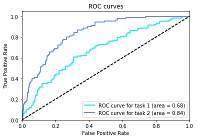
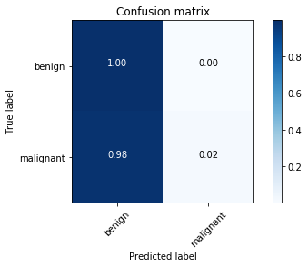

Title: Dermatologist-ai
Date: 2018-06-04
Category: Deep Learning
Tags: Keras, CNN, Transfer Learning
Authors: Cihan Soylu


## Load dataset


```python
from sklearn.datasets import load_files       
from keras.utils import np_utils
import numpy as np
from glob import glob

# define function to load train, test, and validation datasets
def load_dataset(path, shuffle = True):
    data = load_files(path, shuffle=shuffle)
    image_files = np.array(data['filenames'])
    image_targets = np_utils.to_categorical(np.array(data['target']), 3)
    return image_files, image_targets

# load train, test, and validation datasets
train_files, train_targets = load_dataset('data/train')
valid_files, valid_targets = load_dataset('data/valid')
test_files, test_targets = load_dataset('data/test', shuffle = False)


# print statistics about the dataset
print('There are %s total images.\n' % len(np.hstack([train_files, valid_files, test_files])))
print('There are %d training images.' % len(train_files))
print('There are %d validation images.' % len(valid_files))
print('There are %d test images.'% len(test_files))
```

    There are 2750 total images.

    There are 2000 training images.
    There are 150 validation images.
    There are 600 test images.


## Bottleneck Features for Xception


```python
from keras.preprocessing import image

def path_to_tensor(img_path):
    # loads RGB image as PIL.Image.Image type
    img = image.load_img(img_path, target_size=(512, 512))
    # convert PIL.Image.Image type to 3D tensor with shape (512, 512, 3)
    x = image.img_to_array(img)
    # convert 3D tensor to 4D tensor with shape (1, 512, 512, 3) and return 4D tensor
    return np.expand_dims(x, axis=0)

def paths_to_tensor(img_paths):
    list_of_tensors = [path_to_tensor(img_path) for img_path in img_paths]
    return np.vstack(list_of_tensors)
```


```python
from keras.applications.xception import preprocess_input, Xception
from keras.models import Model
from keras.layers import Input

block = 'block4_pool'

base_model = Xception(include_top = False, weights = 'imagenet', input_shape = (512, 512, 3))
model = Model(inputs=base_model.input, outputs=base_model.get_layer(block).output)

def bottleneck_features(img_paths):
    img_input = preprocess_input(paths_to_tensor(img_paths))
    return model.predict(img_input)

```


```python
from tqdm import tqdm

train_bottleneck = bottleneck_features(tqdm(train_files))
valid_bottleneck = bottleneck_features(tqdm(valid_files))
test_bottleneck = bottleneck_features(tqdm(test_files))
```

    100%|██████████| 2000/2000 [04:39<00:00,  7.15it/s]
    100%|██████████| 150/150 [00:37<00:00,  4.60it/s]
    100%|██████████| 600/600 [03:50<00:00,  2.60it/s]


```python
np.savez('bottleneck_features/bottleneck_features_block4_pool', train=train_bottleneck, valid = valid_bottleneck, test = test_bottleneck)
```


```python
bottleneck_features = np.load('bottleneck_features/bottleneck_features_block4_pool.npz')
train_bottleneck = bottleneck_features['train']
valid_bottleneck = bottleneck_features['valid']
test_bottleneck = bottleneck_features['test']
```


```python
from keras.layers import Conv2D, MaxPooling2D, GlobalAveragePooling2D
from keras.layers import Dropout, Flatten, Dense
from keras.models import Sequential

model = Sequential()
model.add(GlobalAveragePooling2D(input_shape=train_bottleneck.shape[1:]))
model.add(Dense(3, activation='softmax'))

model.summary()
```

    _________________________________________________________________
    Layer (type)                 Output Shape              Param #   
    =================================================================
    global_average_pooling2d_2 ( (None, 728)               0         
    _________________________________________________________________
    dense_2 (Dense)              (None, 3)                 2187      
    =================================================================
    Total params: 2,187.0
    Trainable params: 2,187.0
    Non-trainable params: 0.0
    _________________________________________________________________


```python
model.compile(loss='categorical_crossentropy', optimizer='rmsprop', metrics=['accuracy'])
```


```python
from keras.callbacks import ModelCheckpoint   

# train the model
checkpointer = ModelCheckpoint(filepath='saved_models/xception.block4.pool.weights.best.hdf5', verbose=1,
                               save_best_only=True)
model.fit(train_bottleneck, train_targets, epochs=20, validation_data=(valid_bottleneck, valid_targets),
          callbacks=[checkpointer], verbose=1, shuffle=True)
```

    Train on 2000 samples, validate on 150 samples
    Epoch 1/20
    1984/2000 [============================>.] - ETA: 0s - loss: 0.8246 - acc: 0.6663Epoch 00000: val_loss improved from inf to 0.99720, saving model to saved_models/xception.block4.pool.weights.best.hdf5
    2000/2000 [==============================] - 7s - loss: 0.8264 - acc: 0.6660 - val_loss: 0.9972 - val_acc: 0.5333
    Epoch 2/20
    1984/2000 [============================>.] - ETA: 0s - loss: 0.7414 - acc: 0.6885Epoch 00001: val_loss did not improve
    2000/2000 [==============================] - 5s - loss: 0.7390 - acc: 0.6895 - val_loss: 1.0498 - val_acc: 0.5267
    Epoch 3/20
    1984/2000 [============================>.] - ETA: 0s - loss: 0.7157 - acc: 0.7011Epoch 00002: val_loss improved from 0.99720 to 0.99450, saving model to saved_models/xception.block4.pool.weights.best.hdf5
    2000/2000 [==============================] - 5s - loss: 0.7148 - acc: 0.7015 - val_loss: 0.9945 - val_acc: 0.5333
    Epoch 4/20
    1984/2000 [============================>.] - ETA: 0s - loss: 0.6994 - acc: 0.7092Epoch 00003: val_loss improved from 0.99450 to 0.94912, saving model to saved_models/xception.block4.pool.weights.best.hdf5
    2000/2000 [==============================] - 5s - loss: 0.6994 - acc: 0.7095 - val_loss: 0.9491 - val_acc: 0.5800
    Epoch 5/20
    1984/2000 [============================>.] - ETA: 0s - loss: 0.6926 - acc: 0.7152Epoch 00004: val_loss improved from 0.94912 to 0.90901, saving model to saved_models/xception.block4.pool.weights.best.hdf5
    2000/2000 [==============================] - 5s - loss: 0.6929 - acc: 0.7140 - val_loss: 0.9090 - val_acc: 0.5933
    Epoch 6/20
    1984/2000 [============================>.] - ETA: 0s - loss: 0.6798 - acc: 0.7087Epoch 00005: val_loss did not improve
    2000/2000 [==============================] - 5s - loss: 0.6798 - acc: 0.7085 - val_loss: 0.9510 - val_acc: 0.5800
    Epoch 7/20
    1984/2000 [============================>.] - ETA: 0s - loss: 0.6739 - acc: 0.7137Epoch 00006: val_loss improved from 0.90901 to 0.87726, saving model to saved_models/xception.block4.pool.weights.best.hdf5
    2000/2000 [==============================] - 5s - loss: 0.6763 - acc: 0.7130 - val_loss: 0.8773 - val_acc: 0.6200
    Epoch 8/20
    1984/2000 [============================>.] - ETA: 0s - loss: 0.6718 - acc: 0.7046Epoch 00007: val_loss improved from 0.87726 to 0.86197, saving model to saved_models/xception.block4.pool.weights.best.hdf5
    2000/2000 [==============================] - 5s - loss: 0.6721 - acc: 0.7045 - val_loss: 0.8620 - val_acc: 0.6133
    Epoch 9/20
    1984/2000 [============================>.] - ETA: 0s - loss: 0.6649 - acc: 0.7152Epoch 00008: val_loss did not improve
    2000/2000 [==============================] - 5s - loss: 0.6658 - acc: 0.7155 - val_loss: 0.8753 - val_acc: 0.6267
    Epoch 10/20
    1984/2000 [============================>.] - ETA: 0s - loss: 0.6618 - acc: 0.7162Epoch 00009: val_loss improved from 0.86197 to 0.86041, saving model to saved_models/xception.block4.pool.weights.best.hdf5
    2000/2000 [==============================] - 5s - loss: 0.6625 - acc: 0.7165 - val_loss: 0.8604 - val_acc: 0.6200
    Epoch 11/20
    1984/2000 [============================>.] - ETA: 0s - loss: 0.6522 - acc: 0.7193Epoch 00010: val_loss did not improve
    2000/2000 [==============================] - 5s - loss: 0.6536 - acc: 0.7185 - val_loss: 0.9018 - val_acc: 0.6067
    Epoch 12/20
    1984/2000 [============================>.] - ETA: 0s - loss: 0.6584 - acc: 0.7223Epoch 00011: val_loss did not improve
    2000/2000 [==============================] - 5s - loss: 0.6596 - acc: 0.7215 - val_loss: 0.9023 - val_acc: 0.6133
    Epoch 13/20
    1984/2000 [============================>.] - ETA: 0s - loss: 0.6526 - acc: 0.7182Epoch 00012: val_loss did not improve
    2000/2000 [==============================] - 5s - loss: 0.6520 - acc: 0.7190 - val_loss: 0.9678 - val_acc: 0.5467
    Epoch 14/20
    1984/2000 [============================>.] - ETA: 0s - loss: 0.6520 - acc: 0.7172Epoch 00013: val_loss did not improve
    2000/2000 [==============================] - 5s - loss: 0.6531 - acc: 0.7165 - val_loss: 1.0126 - val_acc: 0.5533
    Epoch 15/20
    1984/2000 [============================>.] - ETA: 0s - loss: 0.6527 - acc: 0.7157Epoch 00014: val_loss did not improve
    2000/2000 [==============================] - 5s - loss: 0.6512 - acc: 0.7165 - val_loss: 0.8929 - val_acc: 0.6267
    Epoch 16/20
    1984/2000 [============================>.] - ETA: 0s - loss: 0.6453 - acc: 0.7177Epoch 00015: val_loss did not improve
    2000/2000 [==============================] - 5s - loss: 0.6469 - acc: 0.7165 - val_loss: 0.8750 - val_acc: 0.5933
    Epoch 17/20
    1984/2000 [============================>.] - ETA: 0s - loss: 0.6469 - acc: 0.7228Epoch 00016: val_loss did not improve
    2000/2000 [==============================] - 5s - loss: 0.6464 - acc: 0.7230 - val_loss: 0.9112 - val_acc: 0.6067
    Epoch 18/20
    1984/2000 [============================>.] - ETA: 0s - loss: 0.6454 - acc: 0.7193Epoch 00017: val_loss did not improve
    2000/2000 [==============================] - 5s - loss: 0.6455 - acc: 0.7180 - val_loss: 0.9280 - val_acc: 0.5933
    Epoch 19/20
    1984/2000 [============================>.] - ETA: 0s - loss: 0.6409 - acc: 0.7172Epoch 00018: val_loss improved from 0.86041 to 0.85187, saving model to saved_models/xception.block4.pool.weights.best.hdf5
    2000/2000 [==============================] - 5s - loss: 0.6396 - acc: 0.7185 - val_loss: 0.8519 - val_acc: 0.6200
    Epoch 20/20
    1984/2000 [============================>.] - ETA: 0s - loss: 0.6378 - acc: 0.7248Epoch 00019: val_loss did not improve
    2000/2000 [==============================] - 5s - loss: 0.6374 - acc: 0.7255 - val_loss: 0.8948 - val_acc: 0.6067


    <keras.callbacks.History at 0x7f8e1b147710>


```python
model.load_weights('saved_models/xception.block4.pool.weights.best.hdf5')
```


```python
predictions = [np.argmax(model.predict(np.expand_dims(feature, axis=0))) for feature in test_bottleneck]

# report test accuracy
test_accuracy = 100*np.sum(np.array(predictions) == np.argmax(test_targets, axis=1))/len(predictions)
print('\nTest accuracy: %.4f%%' % test_accuracy)

from sklearn.metrics import roc_auc_score, auc, roc_curve

pred_prob = [model.predict(np.expand_dims(feature, axis=0)) for feature in test_bottleneck]
pred_prob_of_mel = [prob[0,0] for prob in pred_prob]

vec_int = np.vectorize(int)
target_melanoma = vec_int(test_targets[:,0] == 1)

fpr_1, tpr_1, _ = roc_curve(target_melanoma, pred_prob_of_mel)
roc_auc_1 = auc(fpr_1, tpr_1)

#roc_auc_mel_or_not = roc_auc_score(target_melanoma, pred_prob_of_mel)
print("ROC_AUC score for melanoma or not: {}".format(roc_auc_1))

pred_ker = [prob[0,2] for prob in pred_prob]
target_ker = vec_int(test_targets[:,2] == 1)

fpr_2, tpr_2, _ = roc_curve(target_ker, pred_ker)
roc_auc_2 = auc(fpr_2, tpr_2)

#roc_auc_mel_or_ker = roc_auc_score(target_ker, pred_ker)
print("ROC_AUC score for melanocytes or keratinocytes: {}".format(roc_auc_2))

```


    Test accuracy: 68.3333%
    ROC_AUC score for melanoma or not: 0.6787882005273309
    ROC_AUC score for melanocytes or keratinocytes: 0.8398474945533769


```python
import pandas as pd

df = pd.DataFrame(test_files, columns=['Id'])
df['task_1'] = pred_prob_of_mel
df['task_2'] = pred_ker

df.to_csv('predictions.csv', index=False)
```


```python
run get_results.py predictions.csv
```





    Category 1 Score: 0.679
    Category 2 Score: 0.840
    Category 3 Score: 0.759



